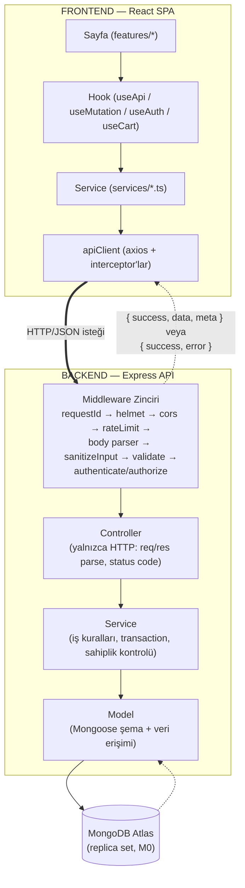
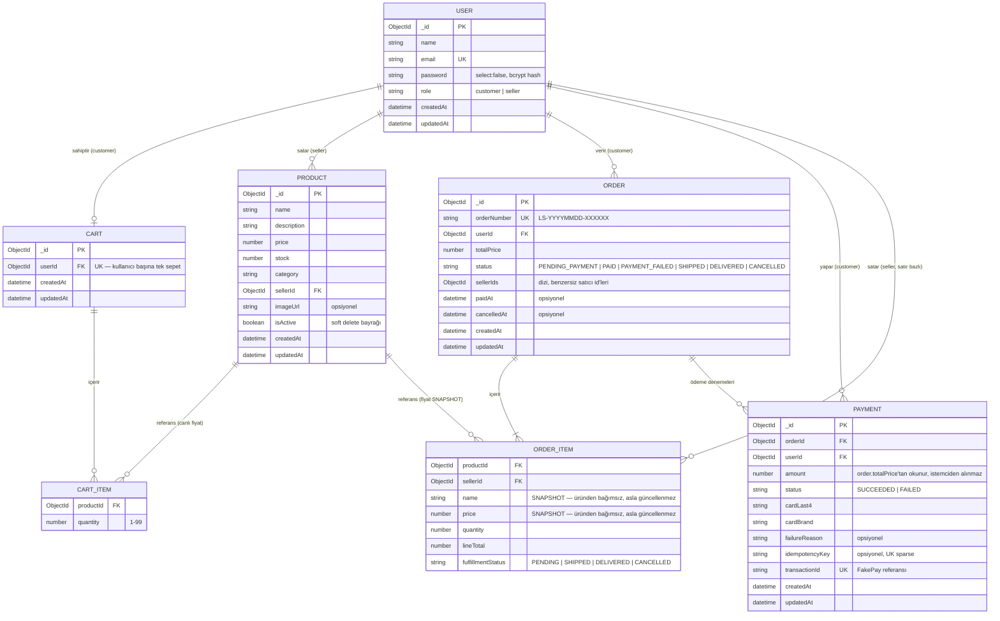
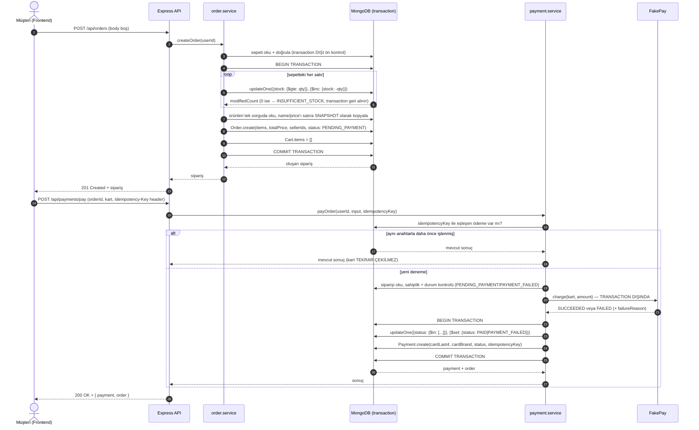
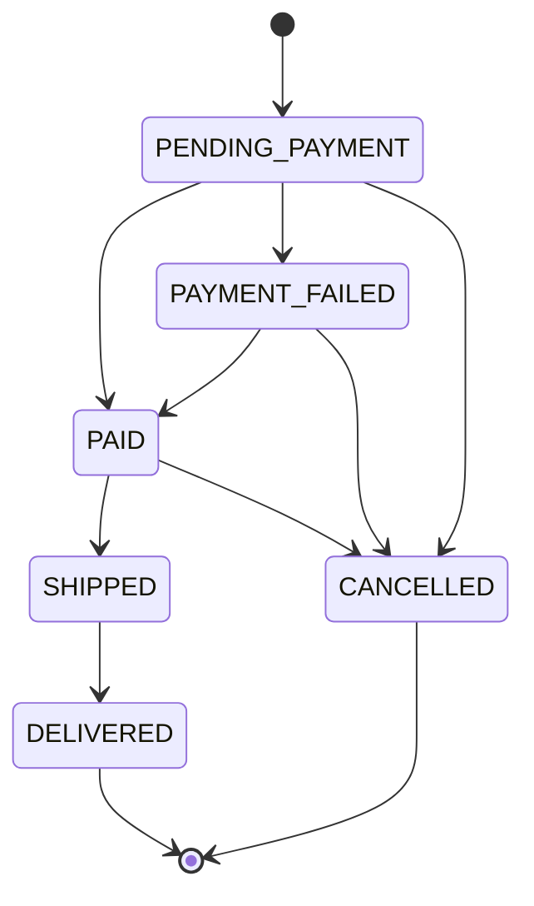
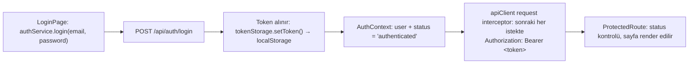

# LocalShop

Yerel üreticilerin ürünlerini doğrudan müşterilere sattığı, iki rollü (customer / seller) bir marketplace MVP'si.


## İçindekiler

- [Genel Bakış](#genel-bakış)
- [Teknoloji Yığını](#teknoloji-yığını)
- [Mimari](#mimari)
- [Kurulum](#kurulum)
- [Örnek Veri](#örnek-veri)
- [API Dokümantasyonu](#api-dokümantasyonu)
- [Özellikler](#özellikler)
- [Güvenlik](#güvenlik)
- [Tasarım Kararları](#tasarım-kararları)
- [Bilinen Kısıtlar](#bilinen-kısıtlar)
- [Komut Referansı](#komut-referansı)
- [Proje Yapısı](#proje-yapısı)
- [Lisans](#lisans)

## Genel Bakış

LocalShop, yerel/küçük ölçekli üreticilerin (bal, sabun, kilim, çay gibi el yapımı veya
yöresel ürünler) kendi ürünlerini doğrudan müşteriye satabildiği iki taraflı bir pazaryeri
MVP'sidir. Aracısız satışın çözdüğü problem basit: bir üretici bugün ya bir pazaryeri devine
komisyon ödemek ya da hiç dijital satış kanalı olmadan çalışmak zorunda; LocalShop bu ikisi
arasında, kendi ürününü kendi hesabıyla yöneten hafif bir alternatif sunar.

Uçtan uca akış: **seller kayıt olur → ürün ekler → customer ürünleri görüntüler → sepete
ekler → sipariş oluşturur → FakePay (simüle ödeme sağlayıcısı) ile öder → seller siparişi
yönetir (kargoya ver / teslim edildi).**

### Öne Çıkan Özellikler

- **İki bağımsız rol** (`customer`, `seller`) — ayrı yetki setleri, ayrı sayfa akışları.
- **Gerçek zamanlı sepet doğrulaması** — fiyat her okumada canlı çekilir, stok/aktiflik
  sorunları satır bazında işaretlenir.
- **Atomik, transaction'lı sipariş oluşturma** — stok düşümü, fiyat snapshot'ı ve sepet
  temizleme tek bir MongoDB transaction'ında, ya hep ya hiç.
- **Çok satıcılı sipariş desteği** — tek bir sipariş birden fazla satıcının ürününü
  içerebilir; her satıcı yalnızca kendi satırını görür ve yönetir.
- **Simüle ödeme akışı (FakePay)** — gerçek bir kart ağına bağlanmadan, Luhn kontrolü ve
  test kartlarıyla başarılı/başarısız senaryoları uçtan uca test edilebilir; idempotency
  key ile çifte tahsilat engellenir.
- **Uçtan uca güvenlik sertleştirmesi** — JWT algorithm pinning, rate limiting, NoSQL
  enjeksiyon/prototype pollution savunması, IDOR koruması; hepsi otomatik bir denetim
  script'iyle (`npm run audit:security`) doğrulanabilir.
- **Kod-öncelikli API dokümantasyonu** — OpenAPI 3.1 dokümanı Zod şemalarından programatik
  üretilir (Swagger UI + statik JSON), ek olarak otomatik token/id zincirlemeli bir Postman
  koleksiyonu bulunur.

### Ekran Görüntüleri

> TODO — demo videosu çekilirken doldurulacak. Aşağıdaki 7 akışın (bkz.
> [Özellikler → Uçtan Uca Kullanıcı Akışları](#uçtan-uca-kullanıcı-akışları)) her birinden
> en az bir ekran görüntüsü planlanıyor:

- [ ] Satıcı kaydı (`/register`, seçili "Satıcı" kartı)
- [ ] Ürün ekleme formu (`/seller/products/new`)
- [ ] Katalog (`/products`, filtreler açık)
- [ ] Ürün detayı + sepete ekle (`/products/:id`)
- [ ] Sepet (`/cart`, sorun uyarısı olan bir satırla)
- [ ] Ödeme formu ve başarı ekranı (`/payment/:orderId`)
- [ ] Satıcı sipariş yönetimi (`/seller/orders`, "Kargoya Ver" onay modalı)

### Demo Video

> TODO — teslim öncesi doldurulacak.

## Teknoloji Yığını

| Katman            | Teknoloji                                                                 |
| ------------------ | -------------------------------------------------------------------------- |
| **Backend**        | Node.js 20+, Express 5, TypeScript 6 (strict mod), Mongoose 9, Zod 4       |
| Backend — yardımcı  | dotenv, cors, helmet, morgan, express-rate-limit, jsonwebtoken, bcryptjs, tsconfig-paths |
| **Frontend**        | React 19, TypeScript 6, Vite 8, React Router 7, styled-components 6, Axios 1 |
| **Veritabanı**      | MongoDB Atlas (M0 ücretsiz tier — yönetilen replica set, transaction desteği hazır gelir) |
| **API Dokümantasyonu** | OpenAPI 3.1 (Zod şemalarından programatik üretilir) + Swagger UI + Postman/Newman |
| **Test/Doğrulama**  | Uçtan uca güvenlik denetim script'i (`securityAudit.ts`), Newman ile doğrulanmış Postman koleksiyonu |

Backend `type: "commonjs"`, frontend `type: "module"` olarak yapılandırılmıştır; ikisi de
bağımsız `package.json`'a sahip ayrı npm projeleridir (monorepo aracı — Turborepo, Nx vb. —
kullanılmaz, bu ölçekte gerekli görülmedi).

## Mimari

### Katman Diyagramı

Bir isteğin uçtan uca yolculuğu — frontend'deki bir sayfa bileşeninden MongoDB'ye kadar:



Zarf açma (`{ success, data }` → `data`) ve hata normalize etme yalnızca `apiClient.ts`'te
olur; `features/` bileşenleri asla doğrudan `axios` çağırmaz, backend'de `controller`
katmanı asla Mongoose sorgusu yazmaz. Her katman yalnızca bir üsttekine/altındakine
bağımlıdır, iki katman atlanmaz.

### Backend Klasör Yapısı ve Feature-Folder Gerekçesi

```
backend/src/
├── config/        # env doğrulama (Zod) ve veritabanı bağlantı kurulumu — açılışta BİR KEZ çalışır
├── middlewares/    # Express middleware'leri — istek/yanıt döngüsüne HER İSTEKTE girer
├── shared/         # modüller arası paylaşılan, iş kuralı İÇERMEYEN yardımcılar (AppError, asyncHandler vb.)
├── modules/        # feature-folder yapısı — her feature kendi routes/controller/service/model/schema'sını barındırır
├── docs/           # OpenAPI dokümanı (Zod şemalarından programatik üretilir) + Swagger UI mount'u
├── app.ts          # Express app kurulumu (middleware zinciri, /health, 404 handler) — port DİNLEMEZ
└── server.ts       # bootstrap: DB bağlantısı + listen + graceful shutdown
```

`config`, `middlewares`, `shared` ve `modules` birbirinden kasıtlı olarak ayrıdır — hiçbiri
bir diğerinin işini yapmaz. `modules/<feature>/` (ör. `modules/order/`) kendi
`*.routes.ts`, `*.controller.ts`, `*.service.ts`, `*.model.ts`, `*.schema.ts` dosyalarını
bir arada tutar: yeni bir özellik eklemek büyük ölçüde tek bir klasöre dokunmak anlamına
gelir, özellikler arası çapraz bağımlılık en aza iner. Katman içinde de sıkı bir sorumluluk
ayrımı zorunludur: **controller** yalnızca HTTP'yi (request/response ayrıştırma, status
code) yönetir; **iş kuralları** (doğrulama, transaction, sahiplik kontrolü) yalnızca
**service**'te yaşar; **veri erişimi** yalnızca **model**'e hapsedilir. Bu ayrım kod
incelemesinde de mekanik bir kontrole dönüşür: bir controller'da `Model.find(...)` görürseniz
bu bir mimari ihlalidir.

Tüm hatalar `AppError` sınıfıyla fırlatılır ve tek bir merkezi error middleware'de yakalanır;
başarılı/başarısız tüm response'lar aynı zarf formatını kullanır
(`{ success: true, data, meta? }` / `{ success: false, error: { message, code, details? } }`).
`process.env`, uygulama boyunca `string | undefined` olarak dolaşmaz — `config/env.ts`'te
Zod ile açılışta bir kez valide edilir; eksik/hatalı bir değişken varsa uygulama fail-fast
şekilde, anlaşılır bir hatayla kapanır.

### Veri Modeli



`CART_ITEM` ve `ORDER_ITEM`, ayrı koleksiyonlar DEĞİLDİR — sırasıyla `Cart.items` ve
`Order.items` altında **gömülü** (embedded) alt belgelerdir; diyagramda ayrı varlık olarak
gösterilmeleri yalnızca alanlarını okunur kılmak içindir. İki gömülü dizinin birbirinden
kasıtlı olarak farklı davrandığına dikkat edin: `CART_ITEM` yalnızca `productId` + `quantity`
tutar (fiyat her okumada canlı çekilir), `ORDER_ITEM` ise `name`/`price`'ı SNAPSHOT olarak
donduran ekstra alanlar taşır (bkz.
[Tasarım Kararları → Sepette canlı fiyat, siparişte snapshot](#sepette-canlı-fiyat-siparişte-snapshot)).

### Sipariş + Ödeme Akışı

Bir müşterinin "Siparişi Tamamla"dan "Ödeme başarılı" ekranına kadar sunucu tarafında olan
biten — stok düşümü, fiyat snapshot'ı, sepet temizleme ve ödeme adımlarıyla:



Dış servis çağrısı (`FakePay.charge`) bilinçli olarak transaction'ın **dışındadır**: transaction
boyunca tutulan veritabanı kilidi dış servis yavaşlarsa gereksiz uzar, ayrıca
`withTransaction` geçici hatalarda callback'i baştan çalıştırabileceği için çağrı transaction
içinde olsaydı kart iki kez çekilebilirdi. `Idempotency-Key` kontrolü ise en baştadır — aynı
anahtarla gelen bir retry, FakePay'e hiç uğramadan önceki sonucu döner.

### Sipariş Durum Makinesi

`Order.status`, siparişin ödeme/teslimat yaşam döngüsünü temsil eder:



`CANCELLED`, case study'nin verdiği durum listesinde yoktu; ödemesi hiç yapılmamış veya
başarısız olmuş bir siparişin düşürdüğü stoğu serbest bırakacak bir terminal duruma ihtiyaç
olduğu için bilinçli eklendi. Sipariş ayrıca satır bazlı bir ikinci durum daha taşır —
`OrderItem.fulfillmentStatus` (`PENDING`/`SHIPPED`/`DELIVERED`/`CANCELLED`) — her satıcı
yalnızca kendi satırlarının kargo durumunu değiştirebilir; `Order.status` bu satır
durumlarından **türetilir**, tersi bir ilişki yoktur (detay:
[Tasarım Kararları → Çok satıcılı siparişte iki seviyeli durum modeli](#çok-satıcılı-siparişte-iki-seviyeli-durum-modeli)).

### Frontend Mimarisi

```
frontend/src/
├── components/   # paylaşılan, sayfadan bağımsız UI bileşenleri (ui/, layout/, orders/, feedback/)
├── features/     # sayfa/özellik bazlı bileşenler (auth/, catalog/, cart/, orders/, payment/, seller/, misc/)
├── services/     # API çağrı katmanı — HER dış istek buradan geçer
├── hooks/        # paylaşılan custom hook'lar (useApi, useMutation, useDebounce, useAuth, useCart, ...)
├── context/      # AuthContext, CartContext, ToastContext
├── routes/       # route tanımları, path sabitleri, erişim guard'ları (ProtectedRoute, PublicOnlyRoute)
├── styles/       # theme, GlobalStyle, styled-components tip genişletmesi
├── types/        # api.ts (zarf tipleri), models.ts (backend response tipleri — elle senkron tutulur)
└── utils/        # genel yardımcılar
```

(Tam, açıklamalı ağaç için bkz. [Proje Yapısı](#proje-yapısı).) Her klasörün tek bir
sorumluluğu vardır: `features/` bileşenleri asla doğrudan `axios` çağırmaz (bu `services/`'in
işidir), `services/` React'a dair hiçbir şey bilmez (state tutmaz, hook değildir), state ve
React'a özgü mantık yalnızca `hooks/` ve `context/`'te yaşar.

**Kimlik doğrulama akışı:**



Sayfa yenilendiğinde `AuthContext`, `localStorage`'da token varsa mount olur olmaz
`GET /api/auth/me` çağırır; cevap gelene kadar `status` `"loading"` kalır — bu süre boyunca
`ProtectedRoute` **hiçbir yönlendirme yapmaz**, tam sayfa bir yükleniyor göstergesi render
eder (aksi halde geçerli bir oturumu olan kullanıcı, `/auth/me` cevabı gelmeden `/login`'e
fırlatılırdı). `/auth/me` başarısız olursa token temizlenir, `status` `"unauthenticated"`
olur. Rolü uygun olmayan (ama giriş yapmış) bir kullanıcı `/login`'e DEĞİL, bir
"403 - Yetkiniz Yok" ekranına yönlendirilir — sorun kimlik doğrulama değil yetkidir.

`apiClient` response interceptor'ı bir `401` yakaladığında — YALNIZCA o an geçerli bir token
varsa VE istek `/auth/login`/`/auth/register` DEĞİLSE — token temizlenir ve `AuthContext`'e
bağlı bir `unauthorizedHandler` (`logout()`) tetiklenir; bir login denemesinde alınan `401`
(yanlış şifre) bu mekanizmayı tetiklemez, çünkü zaten oturum açmamış bir kullanıcı "çıkış"
yapamaz.

**Sepet durumu (`CartContext`):** `AuthProvider`'ın İÇİNDE kurulur çünkü sepetin
yüklenip yüklenmeyeceği doğrudan auth durumuna bağımlıdır — yalnızca
`status === "authenticated" && user.role === "customer"` iken `GET /api/cart` çağrılır (aksi
halde `/api/cart`'ın `authorize("customer")` koruması her sayfa geçişinde kaçınılmaz bir
`403` üretirdi). Sepet mutasyonları backend'in döndürdüğü güncel `CartView`'ı doğrudan
state'e yazar; ayrı bir "tazeleme" isteği gerekmez.

**Route tablosu:**

| Yol                          | Sayfa                    | Erişim                                    |
| ----------------------------- | ------------------------- | ------------------------------------------- |
| `/`, `/products`              | `ProductListPage`         | public                                      |
| `/products/:id`               | `ProductDetailPage`       | public                                      |
| `/login`                      | `LoginPage`                | public (giriş yapmışsa `/`'e yönlendirilir) |
| `/register`                   | `RegisterPage`             | public (giriş yapmışsa `/`'e yönlendirilir) |
| `/cart`                       | `CartPage`                 | customer                                    |
| `/orders`                     | `OrderListPage`            | customer                                    |
| `/orders/:id`                 | `OrderDetailPage`          | customer                                    |
| `/payment/:orderId`           | `PaymentPage`              | customer                                    |
| `/seller`                     | `SellerDashboardPage`      | seller                                      |
| `/seller/products`            | `SellerProductListPage`    | seller                                      |
| `/seller/products/new`        | `SellerProductNewPage`     | seller                                      |
| `/seller/products/:id/edit`   | `SellerProductEditPage`    | seller                                      |
| `/seller/orders`              | `SellerOrdersPage`         | seller                                      |
| `/seller/orders/:id`          | `SellerOrderDetailPage`    | seller                                      |
| `*`                           | `NotFoundPage`             | public                                      |

`/seller/*` route'ları ayrıca `SellerLayout` ile sarılır (Panel/Ürünlerim/Siparişler sekmeli
navigasyon). `customer`/`seller` erişimi `ProtectedRoute allowedRoles={[...]}` ile uygulanır.

## Kurulum

### Gereksinimler

- Node.js 20+
- npm 10+
- MongoDB Atlas hesabı (ücretsiz M0 yeterli)

### Adımlar

1. Repoyu klonla:

   ```bash
   git clone <repo-url>
   cd LocalShop
   ```

2. MongoDB Atlas kurulumu:
   - Ücretsiz M0 cluster oluştur.
   - **Database Access**'ten bir kullanıcı tanımla (`readWriteAnyDatabase` yetkisiyle).
   - **Network Access**'ten geliştirme için `0.0.0.0/0` izni ver.

     > **Uyarı:** `0.0.0.0/0` ayarı **sadece geliştirme** içindir. Production'da sabit IP
     > allowlist veya VPC peering ile daraltılmalıdır.

   - **Connect → Drivers → Node.js** yolundan connection string'i al.
   - Connection string'de veritabanı adının bulunması **zorunludur**:
     `.mongodb.net/localshop?...` şeklinde olmalı — aksi halde veriler `test` veritabanına yazılır.

3. Backend ortam değişkenlerini hazırla:

   ```bash
   cp backend/.env.example backend/.env
   ```

   `backend/.env` içinde en az `MONGO_URI` (adım 2'deki connection string) ve `JWT_SECRET`
   (32+ karakter — `node -e "console.log(require('crypto').randomBytes(48).toString('base64'))"`
   ile üretilebilir) doldurulmalıdır.

4. Backend'i kur ve çalıştır:

   ```bash
   cd backend
   npm install
   npm run dev
   ```

5. (Opsiyonel ama önerilir) Örnek veri yükle — bkz. [Örnek Veri](#örnek-veri):

   ```bash
   npm run seed
   ```

6. Frontend'i kur ve çalıştır (yeni bir terminalde, repo kökünden):

   ```bash
   cd frontend
   npm install
   npm run dev
   ```

7. Doğrulama:
   - Backend health check: [http://localhost:5000/health](http://localhost:5000/health)
   - Backend API dokümantasyonu: [http://localhost:5000/api/docs](http://localhost:5000/api/docs)
   - Frontend: [http://localhost:5173](http://localhost:5173)

## Örnek Veri

Geliştirme ortamında hızlıca test edilebilir veri oluşturmak için bir seed script'i bulunur.
Production'da (`NODE_ENV=production`) çalıştırılamaz — script anında hata verip çıkar.

```bash
cd backend

# Mevcut kullanıcıları/ürünleri koruyarak seed'ler (idempotent — kullanıcı zaten
# varsa yeniden oluşturmaz, satıcının zaten ürünü varsa tekrar ürün eklemez)
npm run seed

# Önce seed kullanıcılarını ve onlara ait ürünleri temizleyip sıfırdan seed'ler
npm run seed:reset
```

3 seller ve 2 customer, sellerlara dağıtılmış ~20 gerçekçi yerel üretici ürünü (kuru
kayısı, zeytinyağlı sabun, el dokuma kilim, kekik çayı vb.) oluşturur. Birkaç ürün stok
testleri için `stock: 0`, birkaçı da `isActive: false` olarak işaretlidir.

**Test hesapları** (hepsinde şifre `Test1234`):

| Rol      | E-posta                  |
| -------- | ------------------------- |
| seller   | seller1@localshop.dev     |
| seller   | seller2@localshop.dev     |
| seller   | seller3@localshop.dev     |
| customer | customer1@localshop.dev   |
| customer | customer2@localshop.dev   |

## API Dokümantasyonu

API sözleşmesi iki eşdeğer biçimde sunulur; değerlendiren kişi ikisinden istediğini kullanabilir.

### Swagger UI (interaktif)

Backend çalışırken tarayıcıdan:

```
http://localhost:5000/api/docs
```

- Doküman, backend'in kendi Zod şemalarından programatik olarak üretilir
  (`backend/src/docs/openapi.ts`) — elle yazılmadığı için bir şema değiştiğinde bayatlamaz.
- Sağ üstteki **Authorize** ile bir `POST /api/auth/login` yanıtından aldığınız token'ı
  (yalnızca token'ın kendisi, `Bearer` öneki olmadan) girin; sayfa yenilendiğinde token
  korunur (`persistAuthorization`).
- **"Try it out"** ile doğrudan tarayıcıdan gerçek istek atabilirsiniz. Bu arayüz yalnızca
  `NODE_ENV !== "production"` iken (veya `ENABLE_API_DOCS=true` ile açıkça) mount edilir ve
  rate limit'ten muaftır; kendine özel, gevşetilmiş bir CSP politikası taşır — API
  endpoint'lerinin taşıdığı sıkı politika bundan etkilenmez.
- Ham OpenAPI 3.1 dokümanı ayrıca `http://localhost:5000/api/docs.json`'dan JSON olarak
  servis edilir.

### OpenAPI JSON (statik)

Sunucuyu ayağa kaldırmadan sözleşmeyi okumak için repoya commit'lenmiş dosya:

```
docs/openapi.json
```

Bu dosya, `backend` içinde `npm run docs:export` ile yeniden üretilir — bir Zod şeması
değiştiğinde bu komut tekrar çalıştırılmalıdır.

### Postman Koleksiyonu

Uçtan uca akışı gösteren, otomatik token/id zincirlemeli bir koleksiyon:

- `docs/LocalShop.postman_collection.json` — 9 klasör (`00 - System` → `08 - Security Tests`), 51 istek
- `docs/LocalShop.postman_environment.json` — `base_url`, seed hesap bilgileri, boş token
  değişkenleri (script'ler dolduracak)

**Kurulum:**

1. Postman'de **Import** → her iki dosyayı da seçin.
2. Sağ üstteki environment açılır listesinden **LocalShop - Local**'i AKTİF environment
   olarak seçin.
3. Backend'in çalıştığından ve seed verisinin yüklü olduğundan emin olun (bkz.
   [Kurulum](#kurulum) / [Örnek Veri](#örnek-veri)).
4. Klasörleri **00'dan 08'e sırayla** çalıştırın. `01 - Auth` klasöründeki "Giriş Yap"
   istekleri, aldıkları token'ı otomatik olarak `customer_token` / `seller_token` /
   `seller2_token` environment değişkenlerine yazar; sonraki tüm istekler
   `Authorization: Bearer {{customer_token}}` gibi bu değişkenleri okur — hiçbir token'ı
   elle kopyalamanız gerekmez. Aynı şekilde `product_id`, `order_id` gibi id'ler de ilgili
   oluşturma isteğinin yanıtından otomatik zincirlenir.

**Tüm koleksiyonu tek seferde çalıştırma (Collection Runner):**

Koleksiyon adının üzerine gelip **▶ Run** ile Collection Runner'ı açın, klasör sırasını
(00→08) koruyarak **Run LocalShop API**'ye basın; Postman 51 isteğin tamamını sırayla
çalıştırıp sonunda kaç test geçti/kaldı özetini gösterir. Aynı işlem komut satırından
Newman ile de yapılabilir:

```bash
npx newman run docs/LocalShop.postman_collection.json -e docs/LocalShop.postman_environment.json
```

Koleksiyon bu şekilde uçtan uca doğrulanmıştır: 51 istek / 173 assertion, hepsi PASS.

> **Not — rate limit:** `01 - Auth` ve `08 - Security Tests` klasörlerindeki `/api/auth/*`
> istekleri `authRateLimit`'e tabidir (varsayılan 15 dakikada 10 istek). Koleksiyonu çok
> kısa aralıklarla art arda birkaç kez çalıştırırsanız bu istekler `429` dönebilir — bu bir
> koleksiyon hatası değil, doğru çalışan bir güvenlik önleminin kanıtıdır (bkz.
> [Güvenlik → Güvenlik Testleri](#güvenlik-testleri) bölümündeki aynı not). Pencere
> sıfırlanana kadar (~15dk) beklemek veya sunucuyu yeniden başlatmak (bellek içi sayaç
> sıfırlanır) yeterlidir.

## Özellikler

### Uçtan Uca Kullanıcı Akışları

Case study'nin istediği 7 uçtan uca akış ve her birinin hangi sayfada, hangi adımlarla
gerçekleştiği. Kendi ortamınızda denerken [Örnek Veri](#örnek-veri) bölümündeki seed
hesaplarını kullanabilirsiniz.

<details>
<summary><strong>1. Satıcı platforma kayıt olur</strong> — <code>/register</code></summary>

1. `/register` sayfasına git.
2. "Satıcı olarak kayıt ol" kartını seç (varsayılan seçim customer'dır, bilerek — bir
   pazaryerinde çoğunluk alıcıdır).
3. Ad (min 2), e-posta, şifre (min 8, en az bir harf + bir rakam) ve şifre tekrarını
   doldur. İstemci doğrulaması backend kurallarını yansıtır ama onun yerine geçmez — asıl
   kabul/red kararı her zaman backend'de verilir.
4. "Kayıt Ol" → `POST /api/auth/register` (`role: "seller"` ile).
5. Başarılı kayıtta otomatik giriş yapılır (backend token döner) ve ana sayfaya
   yönlendirilir; Header'da artık "Satıcı Paneli" linki ve rol rozeti görünür.

</details>

<details>
<summary><strong>2. Satıcı ürün ekler</strong> — <code>/seller/products/new</code></summary>

1. Header'daki "Satıcı Paneli" linkinden `/seller`'a, oradaki "Yeni Ürün Ekle" hızlı
   aksiyonundan (veya doğrudan `/seller/products` → "Yeni Ürün Ekle") `/seller/products/new`'e git.
2. `ProductForm`'u doldur: ad, açıklama (canlı karakter sayaçlı), fiyat, stok, kategori
   (select), opsiyonel görsel URL — girilirse canlı önizleme gösterilir, URL bozuksa
   önizleme yerine "Görsel yüklenemedi" yazar.
3. "Ürünü Ekle" → `POST /api/seller/products`. Sahip alanı (`sellerId`) request body'sinden
   asla okunmaz, `req.user.id`'den atanır.
4. Başarılı eklemede `/seller/products` listesine dönülür, toast gösterilir; yeni ürün
   varsayılan olarak `isActive: true`'dur.

</details>

<details>
<summary><strong>3. Kullanıcı ürünleri görüntüler</strong> — <code>/products</code></summary>

1. `/products` (veya `/`) sayfasına git — herkese açık, giriş gerektirmez.
2. Arama kutusunu kullan (400ms debounce), kategoriye/fiyat aralığına göre filtrele, sırala.
   Tüm filtre durumu URL'de tutulur (`?search=...&category=...`) — sayfa yenilendiğinde
   veya link paylaşıldığında filtreler kaybolmaz.
3. Yalnızca `isActive: true` ürünler listelenir; bir satıcı ürününü pasifleştirirse (adım
   2'nin tersi) burada anında kaybolur.

</details>

<details>
<summary><strong>4. Kullanıcı sepete ürün ekler</strong> — <code>/products/:id</code></summary>

1. Katalogdaki bir ürün kartına tıkla → `/products/:id`.
2. Adet seç (1 ile `min(stok, 99)` arası), "Sepete Ekle"ye bas.
3. **Giriş yapılmamışsa** `/login`'e yönlendirilir; nereden geldiği (`state.from`) taşınır,
   giriş sonrası otomatik olarak bu ürün sayfasına geri dönülür.
4. **Seller hesabıyla girişse** buton devre dışıdır, altında "Satıcı hesabıyla alışveriş
   yapılamaz" açıklaması gösterilir.
5. **Stok 0 ise** buton yine devre dışıdır.
6. Başarılı eklemede toast gösterilir ve Header'daki sepet rozeti (`itemCount`) anında
   güncellenir (`CartContext`, backend'in döndürdüğü güncel sepeti doğrudan state'e yazar).

</details>

<details>
<summary><strong>5. Kullanıcı sipariş oluşturur</strong> — <code>/cart</code></summary>

1. `/cart` sayfasına git.
2. Bir satırın adedini `-`/`+` ile değiştir; satır bu sırada kilitli görünür (çift tıklama
   güvenli). Adet 0'a inerse satır sepetten kalkar.
3. Sorunlu bir satır varsa (ürün artık satışta değil / stok yetersiz) listenin üstünde
   belirgin bir uyarı bloğu ve her sorun için tek tıkla çözüm butonu ("Sepetten çıkar" /
   "Adedi N yap") görünür; özet paneldeki ara toplam sorunlu satırları hiç içermez.
4. "Siparişi Tamamla" — sepette çözülmemiş bir sorun varsa buton devre dışıdır ve altında
   sebep yazar. Tıklanınca `CartContext.createOrderFromCart()` → `POST /api/orders`
   çağrılır; sipariş içeriği İSTEMCİDEN gönderilmez, sunucu o anki sepeti okuyup doğrular.
5. Başarılı oluşturmada sepet iyimser olarak hemen boşaltılır (Header rozeti anında `0`
   olur) ve `/payment/:orderId`'ye yönlendirilir.

</details>

<details>
<summary><strong>6. Kullanıcı sipariş için ödeme yapar</strong> — <code>/payment/:orderId</code></summary>

1. Sipariş özeti (numara, satırlar, toplam tutar, durum rozeti) gösterilir.
2. Kart formunu doldur: numara (yazarken otomatik 4'lü gruplanır), kart üzerindeki isim
   (büyük harfe çevrilir), son kullanma (`MM/YY`, `/` otomatik eklenir), CVV. Yanındaki
   "Test Kartları" kutusundan bir düğmeye basarak formu tek tıkla doldurabilirsin
   (`4242 4242 4242 4242` başarılı, `4000 0000 0000 0000` başarısız senaryosu için).
3. "Ödemeyi Tamamla" → `POST /api/payments/pay`. İstek, sayfa mount olduğunda BİR KEZ
   üretilmiş bir `Idempotency-Key` header'ı taşır — çift tıklama veya ağ hatası sonrası
   retry kartı iki kez çekmez.
4. **Başarısız kartla** (`4000...`) denersen: hata ekranı + sebebe göre Türkçe mesaj +
   "Tekrar Dene" (bu YENİ bir idempotency anahtarı üretir, aksi halde backend aynı
   (başarısız) sonucu tekrar döner) + "Siparişi İptal Et" linki.
5. "Tekrar Dene"ye basıp başarılı kartla (`4242...`) tekrar ödemeyi dene → onay ikonlu
   başarı ekranı, sipariş numarası, "Siparişlerim" / "Alışverişe Devam Et" linkleri.
   Otomatik yönlendirme YAPILMAZ, kullanıcı onayı görmeden sayfa değişmez.
6. Sayfanın altında o siparişe ait TÜM ödeme denemeleri (başarılı + başarısız, tarih/son 4
   hane/marka/sonuç/sebep ile) listelenir — az önceki başarısız deneme de burada görünür.

</details>

<details>
<summary><strong>7. Satıcı siparişi yönetir</strong> — <code>/seller/orders</code></summary>

1. `/seller/orders`'a git; sipariş durumu ve kargo durumu filtrelerini kullan (URL'de tutulur).
2. Her kart: sipariş no (tıklanınca detaya gider), tarih, alıcının SADECE adı (e-postası hiç
   dönmez), durum rozeti, yalnızca BU SATICIYA AİT satırlar, ve `sellerSubtotal` —
   `order.totalPrice` DEĞİL, çünkü o tutar siparişteki diğer satıcıların satırlarını da içerir.
3. Sipariş ödenmiş ve satırlar `PENDING` ise "Kargoya Ver" butonu görünür; backend'in
   reddedeceği bir durumda (ödeme tamamlanmamışsa) buton hiç gösterilmez. Butona basınca
   "Bu siparişteki ürünleriniz kargoya verilmiş olarak işaretlenecek" açıklamalı bir onay
   modalı çıkar.
4. Onaylayınca `PATCH /api/seller/orders/:id/fulfillment` çağrılır, liste tazelenir; aynı
   kart artık "Teslim Edildi" butonunu gösterir (satırlar `SHIPPED` olduğu için).
5. Teslim edildi olarak işaretlendiğinde (`DELIVERED`) artık hiçbir aksiyon butonu kalmaz.

</details>

### Kimlik Doğrulama ve Yetkilendirme

Kullanıcı `POST /api/auth/register` veya `POST /api/auth/login` ile bir JWT access token
alır; bu token, korumalı endpoint'lere yapılan her istekte `Authorization: Bearer <token>`
header'ı ile gönderilir.

| Rol        | Yetkiler                                                       |
| ---------- | ---------------------------------------------------------------- |
| `customer` | Ürünleri görüntüler, sepete ekler, sipariş oluşturur              |
| `seller`   | Ürün ekler/düzenler, kendi ürünlerine ait siparişleri yönetir     |

| Method | Endpoint              | Açıklama                                   | Yetki          |
| ------ | ---------------------- | -------------------------------------------- | -------------- |
| POST   | `/api/auth/register`  | Yeni kullanıcı kaydı                         | Herkese açık   |
| POST   | `/api/auth/login`     | Giriş yapar, JWT access token döner          | Herkese açık   |
| GET    | `/api/auth/me`        | Giriş yapmış kullanıcının bilgisini döner    | `authenticate` |

Alınan somut güvenlik önlemleri (bcrypt, user enumeration/timing attack koruması, JWT
algorithm pinning, rate limiting) [Güvenlik](#güvenlik) bölümünde listelenir; refresh
token'ın neden uygulanmadığı [Tasarım Kararları](#refresh-tokensız-kimlik-doğrulama)'nda
açıklanır.

### Ürün Yönetimi

Seller, kendi ürünlerini `/api/seller/products` altındaki endpoint'ler üzerinden yönetir.
Bu endpoint'lerin tamamı `authenticate` ve `authorize("seller")` ile korunur; ayrıca her
istek, ilgili ürünün gerçekten o seller'a ait olduğunu service katmanında doğrular.

| Method | Endpoint                             | Açıklama                                              | Gerekli Rol |
| ------ | ------------------------------------- | -------------------------------------------------------- | ----------- |
| POST   | `/api/seller/products`               | Yeni ürün oluşturur                                       | `seller`    |
| GET    | `/api/seller/products`               | Kendi ürünlerini listeler (sayfalama, filtre, sıralama)   | `seller`    |
| GET    | `/api/seller/products/:id`           | Kendi ürününün detayını getirir                           | `seller`    |
| PATCH  | `/api/seller/products/:id`           | Ürünü günceller (partial — sadece gönderilen alanlar)     | `seller`    |
| DELETE | `/api/seller/products/:id`           | Ürünü pasifleştirir (soft delete)                          | `seller`    |
| PATCH  | `/api/seller/products/:id/activate`  | Pasifleştirilmiş ürünü tekrar aktive eder                  | `seller`    |

Kategoriler: `food`, `beverage`, `handcraft`, `textile`, `cosmetics`, `home`, `other`.

### Katalog ve Arama

Customer, `/api/products` altındaki endpoint'ler üzerinden herkese açık kataloğu görüntüler.
Bu endpoint'ler kimlik doğrulaması gerektirmez; yalnızca aktif (`isActive: true`) ürünler
listelenir.

| Method | Endpoint                  | Açıklama                                                       | Yetki        |
| ------ | -------------------------- | ------------------------------------------------------------------ | ------------ |
| GET    | `/api/products`            | Aktif ürünleri listeler (sayfalama, filtre, arama, sıralama)        | Herkese açık |
| GET    | `/api/products/:id`        | Aktif bir ürünün detayını getirir                                   | Herkese açık |
| GET    | `/api/products/categories` | Her kategorideki aktif ürün sayısını döndürür                       | Herkese açık |

| Parametre  | Tip    | Varsayılan                                    | Örnek            |
| ---------- | ------ | ------------------------------------------------ | ----------------- |
| `page`     | number | `1`                                                | `page=2`           |
| `limit`    | number | `20`                                               | `limit=10`         |
| `category` | string | —                                                   | `category=food`    |
| `search`   | string | —                                                   | `search=kayısı`     |
| `minPrice` | number | —                                                   | `minPrice=50`       |
| `maxPrice` | number | —                                                   | `maxPrice=200`      |
| `sort`     | string | `search` verilmişse `relevance`, yoksa `newest`     | `sort=priceAsc`     |

`sort` için geçerli değerler: `newest`, `priceAsc`, `priceDesc`, `relevance` (yalnızca
`search` ile birlikte kullanılabilir). Arama MongoDB text index ile yapılır (regex değil) —
gerekçesi ve bilinen kısıtı için bkz. [Bilinen Kısıtlar](#bilinen-kısıtlar).

### Sepet

Customer, `/api/cart` altındaki endpoint'ler üzerinden kendi sepetini yönetir. Bu
endpoint'lerin tamamı `authenticate` ve `authorize("customer")` ile korunur; her
kullanıcının tek bir sepeti olur (`Cart.userId` üzerinde `unique` index).

| Method | Endpoint                       | Açıklama                                                          | Gerekli Rol |
| ------ | ------------------------------- | ---------------------------------------------------------------------- | ----------- |
| GET    | `/api/cart`                    | Sepeti, güncel ürün bilgisiyle zenginleştirilmiş halde getirir         | `customer`  |
| POST   | `/api/cart/items`              | Sepete ürün ekler (varsa adedini artırır)                              | `customer`  |
| PATCH  | `/api/cart/items/:productId`   | Bir kalemin adedini mutlak olarak günceller                            | `customer`  |
| DELETE | `/api/cart/items/:productId`   | Bir kalemi sepetten çıkarır                                            | `customer`  |
| DELETE | `/api/cart`                    | Sepeti tamamen boşaltır                                                | `customer`  |

<details>
<summary>Örnek sepet response'u (sorunlu bir satır dahil)</summary>

```json
{
  "success": true,
  "data": {
    "items": [
      {
        "productId": "665f1a2b3c4d5e6f7a8b9c0d",
        "quantity": 2,
        "product": { "_id": "665f1a2b3c4d5e6f7a8b9c0d", "name": "Kuru Kayısı (500g)", "price": 85, "category": "food", "stock": 45 },
        "unitPrice": 85,
        "lineTotal": 170,
        "available": true,
        "issue": null,
        "availableStock": 45
      },
      {
        "productId": "665f1a2b3c4d5e6f7a8b9c1e",
        "quantity": 3,
        "product": { "_id": "665f1a2b3c4d5e6f7a8b9c1e", "name": "El Dokuma Yün Kilim", "price": 1450, "category": "textile", "stock": 1 },
        "unitPrice": 1450,
        "lineTotal": 4350,
        "available": false,
        "issue": "INSUFFICIENT_STOCK",
        "availableStock": 1
      }
    ],
    "itemCount": 5,
    "distinctItemCount": 2,
    "subtotal": 170,
    "hasIssues": true,
    "issues": [
      { "productId": "665f1a2b3c4d5e6f7a8b9c1e", "productName": "El Dokuma Yün Kilim", "issue": "INSUFFICIENT_STOCK", "requested": 3, "available": 1 }
    ]
  }
}
```

`subtotal` yalnızca `available: true` olan satırların toplamıdır; sorunlu satır tutara
dahil edilmez. İki uygunluk durumu vardır: `PRODUCT_UNAVAILABLE` (ürün silinmiş/pasif —
`product: null` döner) ve `INSUFFICIENT_STOCK` (talep edilen adet mevcut stoğu aşıyor).

</details>

Sepetteki stok kontrolü bir rezervasyon DEĞİLDİR — yalnızca erken geri bildirim sağlar,
gerçek garanti sipariş oluşturma anında transaction içinde uygulanır (bkz. aşağıdaki
Sipariş bölümü ve [Mimari → Sipariş + Ödeme Akışı](#sipariş--ödeme-akışı)).

### Sipariş

Customer, sepetini `POST /api/orders` ile siparişe çevirir; sipariş birden fazla satıcının
ürününü içerebilir. Durum makinesi ve akış detayı için bkz.
[Mimari → Sipariş Durum Makinesi](#sipariş-durum-makinesi) ve
[Mimari → Sipariş + Ödeme Akışı](#sipariş--ödeme-akışı).

**Müşteri:**

| Method | Endpoint                  | Açıklama                                                            | Gerekli Rol |
| ------ | -------------------------- | ------------------------------------------------------------------------ | ----------- |
| POST   | `/api/orders`              | Sepetten sipariş oluşturur (body boştur)                                  | `customer`  |
| GET    | `/api/orders`              | Kendi siparişlerini listeler (sayfalama, durum filtresi, sıralama)        | `customer`  |
| GET    | `/api/orders/:id`          | Kendi siparişinin detayını getirir                                        | `customer`  |
| PATCH  | `/api/orders/:id/cancel`   | Siparişi iptal eder, rezerve edilen stoğu iade eder                       | `customer`  |

**Satıcı:**

| Method | Endpoint                              | Açıklama                                                          | Gerekli Rol |
| ------ | --------------------------------------- | ---------------------------------------------------------------------- | ----------- |
| GET    | `/api/seller/orders`                   | Kendisine gelen siparişleri listeler (yalnızca kendi satırları)         | `seller`    |
| GET    | `/api/seller/orders/:id`               | Gelen bir siparişin detayını getirir (yalnızca kendi satırları)         | `seller`    |
| PATCH  | `/api/seller/orders/:id/fulfillment`   | Kendi satırlarının kargo durumunu günceller (`SHIPPED`/`DELIVERED`)     | `seller`    |

### Ödeme (FakePay)

Customer, `PENDING_PAYMENT` veya `PAYMENT_FAILED` durumundaki bir siparişi
`POST /api/payments/pay` ile öder. Kart bilgileri gerçek bir kart ağına gitmez, tamamen
sunucu içinde simüle edilir (**FakePay**); ödenecek tutar istek gövdesinde YER ALMAZ, sunucu
tutarı `orderId`'ye ait siparişten okur.

| Kart Numarası          | Sonuç                                    |
| ------------------------ | ------------------------------------------- |
| `4242 4242 4242 4242`   | Başarılı (`SUCCEEDED`)                       |
| `4000 0000 0000 0000`   | Başarısız (`FAILED` / `CARD_DECLINED`)       |

Bu iki numara dışındaki her kart Luhn algoritmasına göre değerlendirilir: Luhn'u geçerse
`CARD_DECLINED`, geçmezse `INVALID_CARD_NUMBER` ile reddedilir — yani simülasyonda yalnızca
tanımlı test kartları başarılı sonuç üretir.

| Method | Endpoint                       | Açıklama                                                              | Gerekli Rol |
| ------ | -------------------------------- | -------------------------------------------------------------------------- | ----------- |
| POST   | `/api/payments/pay`             | Bir sipariş için ödeme başlatır                                             | `customer`  |
| GET    | `/api/payments/order/:orderId`  | O siparişe ait tüm ödeme denemelerini (başarılı + başarısız) listeler       | `customer`  |

<details>
<summary>Örnek istek ve yanıt</summary>

```bash
POST /api/payments/pay
Authorization: Bearer <token>
Idempotency-Key: 3f29b1e2-6c41-4e3a-9d3a-9a2d9e6f5b10
Content-Type: application/json

{
  "orderId": "665f1a2b3c4d5e6f7a8b9c0d",
  "cardNumber": "4242424242424242",
  "cardHolder": "ALI TOPBAS",
  "expiry": "12/30",
  "cvv": "123"
}
```

```json
{
  "success": true,
  "data": {
    "payment": {
      "_id": "665f1a2b3c4d5e6f7a8b9c2f",
      "orderId": "665f1a2b3c4d5e6f7a8b9c0d",
      "userId": "665f1a2b3c4d5e6f7a8b9a11",
      "amount": 200,
      "status": "SUCCEEDED",
      "cardLast4": "4242",
      "cardBrand": "VISA",
      "transactionId": "FP-e99d08ca93c2",
      "createdAt": "2026-08-02T19:28:37.995Z",
      "updatedAt": "2026-08-02T19:28:37.995Z"
    },
    "order": {
      "_id": "665f1a2b3c4d5e6f7a8b9c0d",
      "orderNumber": "LS-20260802-VBHBA4",
      "status": "PAID",
      "totalPrice": 200
    }
  }
}
```

Yanıtta kart numarası, CVV veya son kullanma tarihi **hiçbir zaman** yer almaz — yalnızca
`cardLast4` ve `cardBrand` döner, çünkü sunucu bunların dışındaki kart bilgisini zaten hiç
saklamaz.

</details>

`POST /api/payments/pay` isteğine opsiyonel bir `Idempotency-Key` header'ı eklenebilir
(istemcinin ürettiği herhangi bir benzersiz değer, ör. UUID). Aynı anahtarla yapılan tekrar
bir istek — ağ hatası sonrası otomatik retry, çift tıklama gibi senaryolarda — kartı
**yeniden çekmez**, ilk denemenin sonucunu olduğu gibi döner. Çifte ödemeye karşı üç
katmanlı koruma (kısmi unique index + şartlı atomik güncelleme + idempotency key) ve ödeme
endpoint'ine özel rate limiting için bkz. [Güvenlik](#güvenlik).

## Güvenlik

Aşağıdaki tablo, case study'nin güvenlik gereksinim listesini birebir karşılar ve her
maddenin nerede uygulandığını gösterir:

| Gereksinim               | Uygulama                                                       | Dosya                |
| -------------------------- | ------------------------------------------------------------------ | --------------------- |
| password hashing           | bcryptjs, 12 salt round, pre-save hook                               | `user.model.ts`      |
| JWT authentication          | HS256, algorithm pinning, issuer kontrolü                            | `token.service.ts`   |
| input validation            | Zod, body/query/params                                                | `validate.ts`        |
| rate limiting               | global + auth + payment, katmanlı (genel gevşek, özel sıkı)          | `*RateLimit.ts`      |
| CORS kontrolü               | origin whitelist + kendi origin'i (docs sayfası için), credentials    | `security.ts`        |
| environment variables       | Zod ile doğrulanan tipli config                                       | `env.ts`              |
| kart bilgisi saklanmıyor    | yalnızca `cardLast4` + `cardBrand`                                     | `payment.model.ts`   |
| hassas bilgi response'ta yok | `toJSON` transform, `populate()` alan seçimi                          | —                     |

### Ek Güvenlik Önlemleri

Case study'de istenmemiş, ek olarak uygulanan önlemler:

- **User enumeration koruması** (`auth.service.ts`) — register ve login hata mesajları
  e-posta adresini veya kullanıcının var olup olmadığını ele vermez.
- **Timing attack koruması** (`auth.service.ts`) — login'de kullanıcı bulunamasa bile sabit
  bir hash'e karşı bcrypt karşılaştırması çalıştırılır, yanıt süresi kullanıcı varlığına
  göre değişmez.
- **NoSQL enjeksiyon ve prototype pollution savunması** (`sanitizeInput.ts`) — `$` ile
  başlayan/nokta içeren anahtarlar ve `__proto__`/`constructor`/`prototype` request body ve
  params'tan temizlenir; `req.query` için ayrı bir katman yoktur, asıl savunma Zod
  şemalarıdır (`z.string()` bir nesne kabul etmez).
- **Çifte ödeme koruması** (`payment.model.ts`, `payment.service.ts`) — kısmi unique index
  (`{ orderId: 1 }`, yalnızca `status: "SUCCEEDED"`) + idempotency key.
- **Request ID ile izlenebilirlik** (`requestId.ts`) — her isteğe benzersiz bir id atanır,
  5xx loglarına ve hata response'una eklenir.
- **Helmet güvenlik header'ları** (`security.ts`) — sıkı CSP, HSTS (production),
  `X-Powered-By` kapalı, `no-referrer` politikası.
- **Otomatik güvenlik denetim script'i** (`securityAudit.ts`) — bkz. aşağıdaki
  [Güvenlik Testleri](#güvenlik-testleri).

### Trust Proxy ve Rate Limiting

`express-rate-limit`, istemciyi ayırt etmek için `req.ip`'yi kullanır. Express'te bu değerin
nereden okunacağı `app.set("trust proxy", ...)` ayarıyla belirlenir — `TRUST_PROXY` ortam
değişkeninden okunur (`backend/src/config/env.ts`):

- **Uygulama doğrudan dinliyorsa (varsayılan, `TRUST_PROXY=false`):** `req.ip`, bağlantının
  gerçek soket adresinden okunur; istemcinin gönderdiği `X-Forwarded-For` header'ı YOK SAYILIR.
- **Uygulama bir reverse proxy (nginx, ALB, Cloudflare vb.) arkasındaysa:** `TRUST_PROXY`,
  proxy zincirindeki hop sayısına ayarlanmalıdır (ör. tek bir reverse proxy için `TRUST_PROXY=1`).

**Bu ayar yanlış yapılandırılırsa rate limiting işlevsiz kalır.** Uygulama doğrudan
dinlerken `trust proxy` sabit bir sayıya (veya `true`'ya) ayarlanırsa, Express
`X-Forwarded-For` header'ına güvenmeye başlar — bu header istemci tarafından serbestçe
belirlenebilir bir HTTP header'ıdır. Bir saldırgan her istekte farklı bir `X-Forwarded-For`
göndererek kendini her seferinde "farklı bir IP"ymiş gibi gösterebilir ve IP tabanlı rate
limiting'i (login brute force koruması dahil) tamamen atlatabilir. `TRUST_PROXY`,
production'da gerçek altyapı topolojisine göre DOĞRU ayarlanmalıdır.

`npm run audit:security` script'i (test G30) bu senaryoyu otomatik doğrular: art arda farklı
`X-Forwarded-For` değerleriyle login denemesi yapar, bir noktada `429` alınmazsa bu açığın
var olduğunu işaret eder.

### Güvenlik Testleri

Çalışan bir sunucuya (`npm run dev`) gerçek HTTP istekleri atan, tekrar çalıştırılabilir bir
denetim script'i:

```bash
cd backend
npm run audit:security
```

Seed hesaplarını (`seller1`/`seller2`, `customer1`/`customer2`) kullanır, kendi
fixture'larını (sipariş, ürün) HTTP üzerinden oluşturur — DB'ye doğrudan erişmez. 30 test,
7 grupta:

| Grup | Konu             | Neyi doğrular                                                            |
| ---- | ----------------- | ---------------------------------------------------------------------------- |
| A    | Kimlik Doğrulama   | token'sız/bozuk/sahte (`alg:none`)/süresi geçmiş/yanlış secret'lı token'lar   |
| B    | Yetkilendirme      | rol kısıtı (customer↔seller) ve sahiplik kontrolü (IDOR)                    |
| C    | Enjeksiyon         | NoSQL operatör enjeksiyonu, parametre kirliliği, prototype pollution         |
| D    | Veri Sızıntısı     | response'larda password/kart/e-posta/stack trace sızıntısı                  |
| E    | İş Mantığı         | istemciden gelen amount/sellerId/items, durum geçiş kuralları               |
| F    | Rate Limiting      | login ve ödeme endpoint'lerinde limit aşımı (**her zaman en son çalışır**)   |
| G    | Header'lar         | güvenlik header'ları, CORS, trust proxy ile rate-limit atlatma denemesi      |

Herhangi bir test FAIL olursa script `exit code 1` ile çıkar (CI/CD'ye bağlanabilir).

<details>
<summary>Örnek çıktı (özet bölümü)</summary>

```
=== ÖZET ===

  [A1  ] PASS  Token'sız korumalı endpoint
  [A2  ] PASS  Bozuk token
  [A3  ] PASS  "none" algoritmasıyla imzalanmış token (algorithm pinning)
  [A4  ] PASS  Süresi geçmiş token
  [A5  ] PASS  Başka bir secret ile imzalanmış token
  [B6  ] PASS  Customer, seller endpoint'ine erişmeye çalışıyor
  [B7  ] PASS  Seller, customer endpoint'ine erişmeye çalışıyor
  [B8  ] PASS  Seller A, Seller B'nin ürününü güncellemeye çalışıyor (IDOR)
  [B9  ] PASS  Customer A, Customer B'nin siparişini görüntülemeye çalışıyor
  [C10 ] PASS  Login'de $ne operatör enjeksiyonu
  [C11 ] PASS  Query'de operatör enjeksiyonu (category[$ne]=food)
  [C12 ] PASS  Parametre kirliliği (page=1&page=2)
  [C13 ] PASS  __proto__ ile prototype pollution denemesi (register)
  [D14 ] PASS  Register response'unda password/__v yok
  [D15 ] PASS  /api/auth/me response'unda password/__v yok
  [D16 ] PASS  Katalog response'unda satıcı e-postası yok
  [D17 ] PASS  Satıcı sipariş response'unda alıcı e-postası yok
  [D18 ] PASS  Payment response'unda cardNumber/cvv/expiry yok
  [D19 ] PASS  500 hatasında stack trace yok (production simülasyonu)
  [E20 ] PASS  İstemciden gelen amount ile ödeme
  [E21 ] PASS  İstemciden gelen sellerId ile ürün ekleme (yoksayılmalı)
  [E22 ] PASS  İstemciden gelen items ile sipariş oluşturma
  [E23 ] PASS  Ödenmemiş (PENDING_PAYMENT) siparişi kargolama
  [G26 ] PASS  X-Powered-By header'ı yok
  [G27 ] PASS  Content-Security-Policy header'ı var
  [G28 ] PASS  X-Content-Type-Options: nosniff var
  [G29 ] PASS  İzin verilmeyen origin'e CORS izni yok
  [G30 ] PASS  X-Forwarded-For ile rate limit atlatma denemesi (auth limiti)
  [F24 ] PASS  Login'e ardışık başarısız denemeler
  [F25 ] PASS  Ödeme endpoint'ine ardışık istekler

Toplam: 30  Geçti: 30  Kaldı: 0
TÜM TESTLER GEÇTİ
```

</details>

> **Not:** `D19` yalnızca sunucu `NODE_ENV=production` ile çalışırken PASS verir —
> `errorHandler` stack trace'i BİLİNÇLİ olarak sadece development modunda ekler. Normal
> `npm run dev` (development) ile çalıştırıldığında bu tek test FAIL görünür; bu bir script
> hatası değil, doğru çalışan bir güvenlik kontrolünün kanıtıdır. `F` grubu ise
> login/ödeme rate limit sayaçlarını kasıtlı olarak tükettiği için script'i art arda
> çalıştırmak sonraki denemelerde `429` ile karşılaşmanıza sebep olabilir — pencere
> sıfırlanana kadar (varsayılan 15dk) beklemek veya sunucuyu yeniden başlatmak (bellek içi
> sayaç sıfırlanır) yeterlidir.

## Tasarım Kararları

Fazlar boyunca alınan, kod okuyarak fark edilmesi zor kararlar — her biri **karar →
gerekçe → alternatifi neden seçmedik** formatında.

### Sepette canlı fiyat, siparişte snapshot

**Karar:** Sepet şeması yalnızca `productId` ve `quantity` tutar; fiyat her okumada
üründen canlı çekilir. Sipariş satırı ise `name`/`price`'ı oluşturma anında SNAPSHOT olarak
kopyalar ve bir daha asla güncellemez.

**Gerekçe:** Sepet "şu an bu ürün bu fiyata satılıyor" bilgisini taşır — satıcı fiyatı
değiştirdiğinde müşteri sepetinde eski tutarı görmeye devam etmemelidir. Sipariş ise "müşteri
bu ürünü şu fiyata satın aldı" bilgisini kalıcı olarak dondurur — sipariş oluşturulduktan
sonra satıcı fiyatı değiştirse (hatta ürünü silse) bile geçmiş siparişin tutarı değişmemelidir.

**Alternatifi neden seçmedik:** İkisi de aynı davransaydı (ör. sepette de snapshot
tutulsaydı) müşteri sepetinde her zaman güncel fiyatı göremezdi ve fiyat artışlarını
sepete girene kadar fark edemezdi — kötü bir alışveriş deneyimi. Tersi (siparişte de canlı
fiyat) ise çok daha ciddi bir sorun doğururdu: bir müşterinin 6 ay önceki siparişinin
tutarı, o üründe bugün yapılan bir fiyat değişikliğiyle sessizce değişirdi.

### Şart bağlı atomik stok düşümü ve transaction

**Karar:** Stok düşümü `updateOne({ _id, stock: { $gte: qty } }, { $inc: { stock: -qty } })`
şeklinde, şartı sorgunun İÇİNE koyarak yapılır; stok düşümü + sipariş oluşturma + sepet
temizleme tek bir MongoDB transaction'ı içindedir.

**Gerekçe:** Somut bir yarış koşulunu kapatır. Senaryo: stoğu 1 olan bir ürünü iki müşteri
neredeyse aynı anda sipariş etmeye çalışıyor. Şartı sorgunun içine koymak MongoDB'nin tek
belge üzerindeki atomik güncelleme garantisinden faydalanır: ilk isteğin update'i stoğu 0'a
düşürür, ikinci isteğin update'i artık `stock: { $gte: 1 }` şartını sağlamadığı için
`modifiedCount: 0` döner ve uygulama bunu `INSUFFICIENT_STOCK` olarak reddeder. Transaction,
stok/sipariş/sepet adımlarından biri başarısız olursa TÜMÜNÜN geri alınmasını garanti eder.

**Alternatifi neden seçmedik:** "Önce oku, karşılaştır, sonra yaz" deseninde: İstek A stoğu
okur (1), yeterli görür; İstek B henüz A yazmadan stoğu okur (hâlâ 1), o da yeterli görür;
ikisi de düşürmeye çalışır. Sonuç: iki sipariş de "başarılı" görünür ama depoda sadece 1
birim vardır — biri fazladan satılmıştır. Uygulama seviyesinde bir kilit (mutex/lock)
mekanizması da düşünülebilirdi, ama bu hem tek process'i aşan bir dağıtık kilit gerektirir
hem de MongoDB'nin zaten sağladığı atomik garantiyi tekrar icat etmek anlamına gelir.

### Çok satıcılı siparişte iki seviyeli durum modeli

**Karar:** Sipariş iki bağımsız durum alanı taşır: `Order.status` (siparişin ödeme yaşam
döngüsü, tüm satıcılar için ortak tek bir alan) ve `OrderItem.fulfillmentStatus` (her
satırın kendi kargo durumu). `Order.status`, satır bazlı `fulfillmentStatus`
değerlerinden TÜRETİLİR.

**Gerekçe:** Bir siparişte Seller A'nın ürünü kargolanmış, Seller B'ninki henüz
kargolanmamış olabilir. Tek bir `Order.status` bu durumu doğru temsil edemez: `SHIPPED`
demek B'nin satırını görmezden gelir, `PAID` demek A'nın ilerlemesini kaybeder. İki
seviyeli model her iki gerçeği de kaybetmeden taşır: iptal edilmemiş tüm satırlar
`DELIVERED` ise sipariş `DELIVERED`, tümü en az `SHIPPED` ise sipariş `SHIPPED`, aksi
halde (kısmi kargo) `Order.status` olduğu gibi (`PAID`) kalır.

**Alternatifi neden seçmedik:** Tek seviyeli bir model (yalnızca `Order.status`, satıcılar
bu alanı paylaşır) basit olurdu ama iki sorun doğururdu: (1) bir satıcının aksiyonu diğer
satıcının durumunu ezerdi (Seller A "kargoladım" dediğinde B'nin ürünü henüz kargoda
değilken sipariş yanlışlıkla `SHIPPED` görünürdü), (2) satıcılar arası bir yarış koşulu
oluşurdu. Her satırın tamamen bağımsız, kendi `Order` kaydına sahip olması (siparişi
satıcı sayısı kadar parçalara bölmek) de düşünülebilirdi, ama bu müşteri tarafında "tek
sipariş, tek toplam tutar, tek ödeme" deneyimini kırardı.

### Soft delete

**Karar:** Ürün silme işlemi `isActive: false` bayrağıyla yapılır (`DELETE /api/seller/products/:id`);
ürün fiziksel olarak asla silinmez.

**Gerekçe:** Bir ürün gerçekten silinirse, o ürünü içeren sepetler ve geçmiş sipariş
kayıtları referans bütünlüğünü kaybeder — var olmayan bir belgeye işaret ederler.
`isActive: false` ürünü yalnızca katalogdan/aramadan gizler, geçmiş veriyi bozmadan; sipariş
satırları zaten `name`/`price` snapshot'ı taşıdığı için ürünün kendisine bağımlı değildir,
ama `productId` referansının hâlâ geçerli bir belgeye işaret etmesi (ör. ileride "bu ürünü
tekrar sipariş et" gibi bir özellik için) değerlidir.

**Alternatifi neden seçmedik:** Fiziksel silme (`deleteOne`) daha basit olurdu ama üç
katmanda veri bütünlüğünü kırardı: sepetteki referanslar (`CartItem.productId`), geçmiş
sipariş satırlarındaki referanslar, ve satıcının kendi ürün listesi geçmişi. "Silinen
ürünler" için ayrı bir arşiv koleksiyonu tutmak da düşünülebilirdi, ama bu ekstra bir
koleksiyon + senkronizasyon karmaşıklığı getirirdi; tek bir bayrak aynı sonucu çok daha
basit sağlar.

### Refresh token'sız kimlik doğrulama

**Karar:** Yalnızca 1 gün ömürlü (`JWT_EXPIRES_IN=1d`) bir access token kullanılır;
refresh token akışı uygulanmadı.

**Gerekçe:** Doğru bir refresh akışı; token rotasyonu, bir iptal listesi (revocation list)
ve yeniden kullanım tespiti (reuse detection — çalınan bir refresh token'ın fark edilmesi)
gerektirir. MVP kapsamında bu üçünden birini atlayarak "yarım" bir refresh akışı uygulamak,
hiç uygulamamaktan güvenlik açısından daha kötüdür — kullanıcıya sahte bir güvenlik hissi
verir.

**Alternatifi neden seçmedik:** Kısa ömürlü access token + refresh token (ör. 15dk/7gün)
production standardıdır ve daha iyi bir kullanıcı deneyimi (sık sık yeniden giriş
istenmemesi) sunardı, ama yukarıdaki üç bileşen (rotasyon, revocation list, reuse
detection) olmadan bu deseni uygulamak, uzun ömürlü tek bir access token kullanmaktan daha
az güvenli olabilirdi — çalınan bir refresh token, iptal mekanizması yokken süresiz geçerli
kalırdı.

### Rol modeli (capability alternatifi)

**Karar:** Kullanıcı tek bir sabit role (`customer` veya `seller`) sahiptir; roller
birbirini dışlar. Sepet yalnızca `customer`'a, ürün/sipariş yönetimi yalnızca `seller`'a açıktır.

**Gerekçe:** Bu MVP'nin kapsamında basit ve net bir sınır tercih edildi: bir hesap ya
sepete sahiptir ya ürün yönetir, ikisi birden değil. Bu, hem yetkilendirme mantığını
(`authorize("customer")` / `authorize("seller")`) hem de frontend route guard'larını
(`ProtectedRoute allowedRoles={[...]}`) tek bir alan üzerinden basit tutar.

**Alternatifi neden seçmedik:** Gerçek bir pazaryerinde bir kullanıcının hem alıcı hem
satıcı olabilmesi daha gerçekçidir — bu, rol bazlı değil **yetenek (capability) bazlı** bir
model gerektirirdi (ör. `capabilities: ["buy", "sell"]` gibi bir dizi, her ikisi de aynı
anda aktif olabilir). Bu model daha esnek olurdu ama yetkilendirme kontrollerini
(`authorize()` çağrılarının her yerde "rol" yerine "yetenek" kontrolü yapması), veri
modelini (bir kullanıcının hem `Cart`'ı hem `Product`'ları olabilmesi) ve frontend
navigasyonunu (aynı anda hem "Sepetim" hem "Satıcı Paneli" gösterilmesi) belirgin şekilde
karmaşıklaştırırdı — MVP kapsamı için gerekli görülmedi.

### Luhn kontrolünün sağlayıcı katmanında olması

**Karar:** Kart numarasının 13-19 haneli bir sayı olduğu Zod şemasında (`payCardSchema`)
doğrulanır; Luhn algoritması ve test kartı kontrolü ise sağlayıcı katmanında
(`fakePay.provider.ts`) yapılır.

**Gerekçe:** "Kart numarası 13-19 haneli bir sayı mı" bir FORMAT sorusudur ve isteğin
şekliyle ilgilidir; "bu kart gerçekten kabul edilir mi" ise bir İŞ KARARIDIR ve gerçek bir
ödeme sağlayıcısının vereceği bir karardır. Bu ayrım kritiktir çünkü case study'nin
başarısız ödeme senaryosunu temsil eden `4000000000000000` numarası **Luhn kontrolünden
geçmez**. Luhn kontrolü Zod şemasında (formatta) yapılsaydı bu kart `422` ile (yanlış
format) reddedilirdi; oysa amaç bu kartın *geçerli görünen ama banka tarafından reddedilen*
bir kartı simüle etmesidir. FakePay bu yüzden test kartlarını Luhn kontrolünden ÖNCE ele
alır.

**Alternatifi neden seçmedik:** Luhn kontrolünü de Zod şemasına taşımak daha "merkezi"
görünebilirdi, ama iki farklı sorumluluğu (format doğrulama vs. kabul/red kararı) tek bir
katmana karıştırırdı ve case study'nin `4000...` test senaryosunu (Luhn'u geçmeyen ama
"geçerli görünen" bir kart) imkansız hale getirirdi.

### Token'ın localStorage'da tutulması

**Karar:** JWT access token, frontend'de `localStorage`'da tutulur (`tokenStorage.ts`).

**Gerekçe:** Basit, ek bir backend oturum mekanizması gerektirmeyen bir MVP kararıdır.
Bilinçli bir güvenlik ödünüdür: `localStorage`'a JavaScript'ten erişilebilir olduğu için,
sayfada bir XSS açığı olursa token çalınabilir (`httpOnly` bir cookie'nin aksine).

**Alternatifi neden seçmedik:** `httpOnly` + `Secure` bir cookie, token'ı JavaScript'in
erişim alanından tamamen çıkarırdı — üretimde tercih edilecek yaklaşım budur. Ancak bu
kombinasyon genellikle bir CSRF token mekanizmasıyla birlikte gelir (cookie tabanlı oturumlar
CSRF'e açıktır) ve backend'de oturum modelini de etkiler (stateless JWT yerine cookie
tabanlı bir akış, `SameSite`/`CSRF-Token` header yönetimi vb.); bu değişim MVP kapsamının
dışında bırakıldı.

### react-query yerine özel hook

**Karar:** Sunucu durumu yönetimi için react-query (veya benzeri bir kütüphane) yerine iki
küçük özel hook (`useApi`, `useMutation`) yazıldı.

**Gerekçe:** Proje boyunca "istenmeyen paket kurma" ilkesine sadık kalındı. `useApi`/`useMutation`
ikilisi, bu MVP'nin gerçekten ihtiyaç duyduğu iki şeyi (yarış koşulu koruması, unmount
sonrası `setState` koruması) çözecek kadar küçük tutuldu.

**Alternatifi neden seçmedik:** react-query; sorgu sonucu cache'leme, arka planda yeniden
doğrulama, pencereye odaklanınca otomatik yeniden çekme, istek tekilleştirme gibi güçlü
özellikler sunar — ama bu MVP'de aynı veri birden fazla sayfada tekrar tekrar çekilmiyor,
bu yüzden bu özelliklerin getirisi (bağımlılık + öğrenme yükü) maliyetini karşılamıyor. Bu
ihtiyaç arttıkça react-query'ye geçiş değerlendirilebilir.

### Diğer Kararlar (özet)

Yukarıdaki 9 kararın dışında, kod okuyarak fark edilmesi zor diğer noktalar:

- **`/api/seller/products` ve `/api/products` ayrı yollardır.** Aynı yolda rol bazlı
  dallanmak (ör. "seller ise kendi ürünlerini, customer ise tüm aktif ürünleri göster") hem
  route mantığını hem yetkilendirmeyi bulanıklaştırırdı; ayrı yol, ayrı sorumluluk anlamına gelir.
- **Sahiplik kontrolü, rol kontrolünden ayrı bir katmandır.** `authorize("seller")` yalnızca
  isteği yapanın bir seller olduğunu doğrular, *bu spesifik ürünün* sahibi olduğunu
  doğrulamaz — bu ikinci kontrol service katmanında (`sellerId === req.user.id`) ayrıca
  yapılır; atlanırsa klasik bir IDOR açığı doğar.
- **Fiyat `Number` tipinde saklanır** (`Decimal128` veya kuruş cinsinden tam sayı değil) —
  bilinçli bir MVP kısıtıdır, floating point yuvarlama hatası riski taşır.
- **`imageUrl` alanı case study modelinin bir parçası değildir**, katalog görselsiz çok
  zayıf kalacağı için opsiyonel olarak sonradan eklendi.
- **Arama için MongoDB text index kullanıldı, regex değil** — text index bir ters indeks
  üzerinde çalışır ve sorgu planlayıcısı tarafından kullanılabilir, ayrıca `relevance`
  sıralamasını mümkün kılan bir alaka puanı (`textScore`) üretir; regex büyük
  koleksiyonlarda index kullanamaz, her istekte tüm koleksiyonu tarar.
- **Satıcı bilgisi katalogda yalnızca ad olarak paylaşılır** (`seller: { _id, name }`) —
  `populate("sellerId", "name")` ile alan seçimi yapılmadan satıcının e-postası ve tüm
  `User` alanları response'a sızardı.
- **FakePay çağrısı transaction dışında yapılır.** Transaction boyunca tutulan veritabanı
  kilidi dış servis yavaşlarsa gereksiz uzar; `withTransaction` geçici hatalarda callback'i
  baştan çalıştırabileceği için çağrı transaction içinde olsaydı kart iki kez çekilebilirdi.
- **FakePay, gerçek bir sağlayıcıyla değiştirilebilecek şekilde tasarlandı** — modül
  dışarıya yalnızca `charge()` ve `TEST_CARDS`'ı açar; gerçek bir sağlayıcıya geçişte tek
  değişmesi gereken dosya `fakePay.provider.ts`'tir.
- **Tipler backend'den otomatik türetilmiyor, elle yazılıyor** (`frontend/src/types/`) —
  backend bir alanı değiştirdiğinde frontend tipinin fark edilmeden eskimesi riski bilinçli
  kabul edildi; OpenAPI çıktısı ileride bir codegen adımına (ör. `openapi-typescript`) zemin hazırlar.

## Bilinen Kısıtlar

- **Ödeme yapılmadan terk edilen bir sipariş, düştüğü stoğu süresiz rezerve tutar.**
  `PENDING_PAYMENT` durumunda kalan bir sipariş için otomatik bir zaman aşımı yoktur.
  Üretimde bu, siparişe bir `expiresAt` alanı eklenip süresi dolan siparişleri `CANCELLED`'a
  çekip stoğu iade eden arka plan bir işle (cron/queue) çözülür.
- **Kısmi kargo durumunda `Order.status` `PAID`'te kalır.** Bazı satıcılar kargoladı,
  bazıları henüz kargolamadıysa üst seviyedeki `status` bunu yansıtmaz; hangi satırın hangi
  durumda olduğu yalnızca sipariş detayındaki satır bazlı `items[].fulfillmentStatus`
  alanından görülebilir.
- **Refresh token yok, access token 1 gün ömürlü.** Bkz.
  [Tasarım Kararları → Refresh token'sız kimlik doğrulama](#refresh-tokensız-kimlik-doğrulama)
  — bir token çalınırsa, süresi dolana kadar (en fazla 1 gün) iptal edilemez.
- **Rate limiting bellekte (in-memory) tutuluyor.** `express-rate-limit`'in varsayılan
  `MemoryStore`'u tek process için doğru çalışır; birden fazla instance (yatay ölçekleme,
  çoklu container) ile dağıtıldığında her instance kendi sayacını tutar ve gerçek limit
  instance sayısıyla orantılı şekilde gevşer — production'da paylaşılan bir store (Redis) gerekir.
- **HTTPS terminasyonu uygulama dışında varsayılıyor.** Express doğrudan TLS sunmaz;
  production'da bir reverse proxy (nginx, ALB, Cloudflare vb.) HTTPS'i sonlandırıp
  uygulamaya düz HTTP ile bağlanacak şekilde tasarlanmıştır — bu yüzden `TRUST_PROXY`'nin
  doğru ayarlanması (bkz. [Güvenlik](#trust-proxy-ve-rate-limiting)) production'da zorunludur.
- **E-posta doğrulama ve şifre sıfırlama akışları kapsam dışı.** Kayıt anında e-posta
  sahipliği doğrulanmaz, unutulan şifre için bir akış yoktur; bu MVP'nin kapsamı
  customer/seller temel akışıyla sınırlıdır.
- **Metin araması tam kelime eşleşmesi yapar, önek araması desteklenmez.** Örneğin "bal"
  araması "balkabağı" içeren bir ürünü bulmaz, çünkü MongoDB text index kelimeleri
  köklerine indirger ve tam kelime bazında eşleştirir. Üretimde bu kısıt, önek/typo-tolerant
  arama sağlayan MongoDB Atlas Search `autocomplete` operatörü ile çözülecektir.

## Komut Referansı

| Komut                  | Açıklama                                                          | Dizin      |
| ------------------------ | ---------------------------------------------------------------------- | ----------- |
| `npm run dev`            | Geliştirme sunucusunu başlatır (tsx watch)                              | `backend`  |
| `npm run build`          | TypeScript'i `dist/`'e derler                                          | `backend`  |
| `npm run start`          | Derlenmiş build'i çalıştırır (`dist/server.js`)                        | `backend`  |
| `npm run typecheck`      | Tip kontrolü yapar, dosya üretmez (`tsc --noEmit`)                      | `backend`  |
| `npm run lint`           | ESLint çalıştırır                                                       | `backend`  |
| `npm run lint:fix`       | ESLint'i otomatik düzeltmeyle çalıştırır                                | `backend`  |
| `npm run format`         | Prettier ile `src/**/*.ts`'i biçimlendirir                              | `backend`  |
| `npm run seed`           | Örnek veri yükler (idempotent)                                          | `backend`  |
| `npm run seed:reset`     | Seed verisini temizleyip sıfırdan yükler                                | `backend`  |
| `npm run sync-indexes`   | Mongoose şema indekslerini veritabanıyla senkronize eder                | `backend`  |
| `npm run audit:security` | 30 testlik otomatik güvenlik denetimini çalıştırır (sunucu ayakta olmalı) | `backend`  |
| `npm run docs:export`    | OpenAPI dokümanını `docs/openapi.json`'a yeniden üretir                 | `backend`  |
| `npm run dev`            | Vite geliştirme sunucusunu başlatır                                     | `frontend` |
| `npm run build`          | Tip kontrolü + production build (`tsc -b && vite build`)                | `frontend` |
| `npm run typecheck`      | Tip kontrolü yapar, dosya üretmez                                        | `frontend` |
| `npm run lint`           | oxlint çalıştırır                                                        | `frontend` |
| `npm run preview`        | Production build'ini yerelde önizler                                    | `frontend` |
| `npx newman run docs/LocalShop.postman_collection.json -e docs/LocalShop.postman_environment.json` | Postman koleksiyonunu komut satırından çalıştırır | repo kökü |

## Proje Yapısı

```
LocalShop/
├── backend/                    # Express API sunucusu
│   └── src/
│       ├── config/             # env doğrulama (Zod) ve veritabanı bağlantı kurulumu
│       ├── middlewares/        # requestId, helmet, cors, rate limiters, sanitizeInput, validate, authenticate, authorize, errorHandler
│       ├── shared/             # AppError, apiResponse, asyncHandler, commonSchemas, errorCodes, httpStatus, sensitiveFields
│       ├── modules/            # feature-folder yapısı
│       │   ├── auth/           # register, login, me — user.model, token.service
│       │   ├── product/        # seller ürün yönetimi + herkese açık katalog (catalog.*)
│       │   ├── cart/           # müşteri sepeti
│       │   ├── order/          # müşteri + satıcı sipariş uçları, durum makinesi
│       │   └── payment/        # FakePay entegrasyonu, ödeme uçları
│       ├── docs/                # openapi.ts (Zod → OpenAPI 3.1), swagger.ts (Swagger UI mount'u)
│       ├── scripts/             # seed.ts, syncIndexes.ts, securityAudit.ts, exportOpenApi.ts
│       ├── app.ts               # Express app kurulumu (middleware zinciri, /health, 404 handler)
│       └── server.ts            # bootstrap: DB bağlantısı + listen + graceful shutdown
│   ├── .env.example
│   └── package.json
│
├── frontend/                   # React SPA
│   └── src/
│       ├── components/
│       │   ├── ui/             # Button, Input, Select, TextArea, Card, Badge, Spinner, LoadingState, ErrorState, EmptyState, Modal, Pagination
│       │   ├── layout/         # Header (mobilde hamburger menü), Footer, AppLayout
│       │   ├── orders/         # OrderStatusBadge — customer+seller sipariş ekranlarının paylaştığı rozet eşlemesi
│       │   ├── feedback/       # Toast görsel bileşeni
│       │   └── ErrorBoundary.tsx
│       ├── features/           # auth/, catalog/, cart/, orders/, payment/, seller/, misc/
│       ├── services/           # apiClient.ts, apiError.ts, errorMessages.ts, tokenStorage.ts, *Service.ts
│       ├── hooks/               # useApi, useMutation, useDebounce, usePageTitle, useAuth, useCart, useToast
│       ├── context/              # AuthContext, CartContext, ToastContext
│       ├── routes/                # paths.ts, AppRouter.tsx, ProtectedRoute.tsx, PublicOnlyRoute.tsx
│       ├── styles/                 # theme.ts, GlobalStyle.ts, styled-components tip genişletmesi
│       ├── types/                   # api.ts (zarf tipleri), models.ts (backend response tipleri)
│       ├── utils/                    # cleanParams.ts vb.
│       ├── App.tsx
│       └── main.tsx
│   └── package.json
│
└── docs/                        # API dokümantasyonu ve teslim materyalleri
    ├── openapi.json              # OpenAPI 3.1 (backend'den `npm run docs:export` ile üretilir)
    ├── LocalShop.postman_collection.json
    └── LocalShop.postman_environment.json
```

`config`, `middlewares`, `shared` ve `modules` ayrımı ile `features`/`services`/`hooks`/`context`
ayrımının gerekçesi için bkz. [Mimari](#mimari).

## Lisans

Bu proje bir teknik değerlendirme (case study) kapsamında geliştirilmiştir; ayrı bir açık
kaynak lisansı altında dağıtılmamaktadır. `backend/package.json`'daki `license: "ISC"` alanı
şablon varsayılanıdır, repoda ayrı bir `LICENSE` dosyası bulunmaz.
