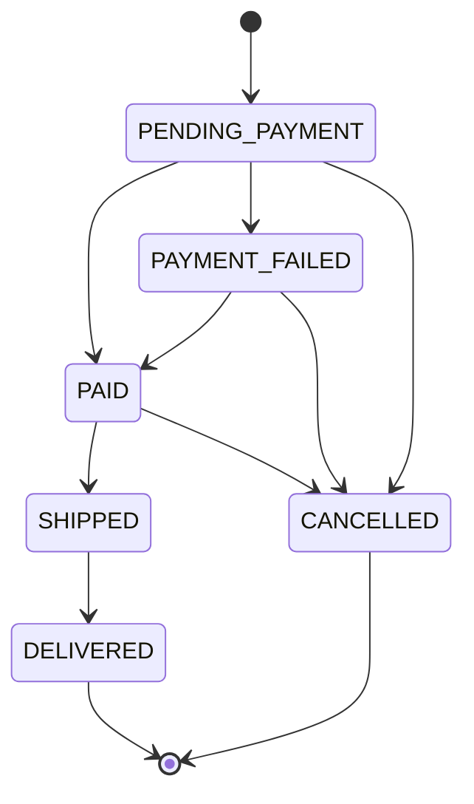
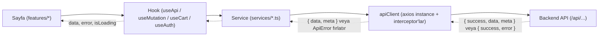
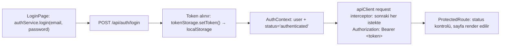

# LocalShop

Yerel üreticilerin ürünlerini doğrudan müşterilere sattığı marketplace MVP'si.
İki kullanıcı rolü: customer ve seller.

## Teknolojiler

**Backend**

- Node.js + Express 5
- TypeScript 6 (strict mod)
- Mongoose 9
- Zod 4 (validasyon ve environment konfigürasyonu)
- dotenv, cors, helmet, morgan, tsconfig-paths

**Frontend**

- React 19
- TypeScript 6
- Vite 8
- React Router 7
- styled-components 6
- Axios 1

## Proje Yapısı

```
LocalShop/
├── backend/          # Express API sunucusu
├── frontend/         # React SPA
└── docs/             # Proje dokümantasyonu
```

**backend/src/**

```
src/
├── config/           # env doğrulama (Zod) ve veritabanı bağlantı kurulumu
├── middlewares/       # Express middleware'leri
├── shared/            # modüller arası paylaşılan yardımcılar (AppError, asyncHandler vb.)
├── modules/           # feature-folder yapısı — her feature kendi routes/controller/service/model/schema dosyalarını barındırır
├── app.ts             # Express app kurulumu (middleware zinciri, /health, 404 handler) — port dinlemez
└── server.ts          # bootstrap: DB bağlantısı + listen + graceful shutdown
```

`config`, `middlewares`, `shared` ve `modules` birbirinden ayrıdır: `config` uygulama açılışında
bir kez çalışan kurulum kodunu (env, DB) barındırır; `middlewares` istek/yanıt döngüsüne giren
Express middleware'lerini içerir; `shared` birden fazla modülün ortak kullandığı, iş kuralı
içermeyen yardımcı kodu (hata sınıfları, tipler, wrapper'lar) tutar; `modules` ise her biri
kendi route/controller/service/model'ine sahip, birbirinden bağımsız feature klasörlerini
barındırır.

**frontend/src/**

```
src/
├── components/        # paylaşılan, sayfadan bağımsız UI bileşenleri
├── features/          # sayfa/özellik bazlı bileşenler
├── services/           # API çağrı katmanı (axios)
├── hooks/              # paylaşılan custom hook'lar
├── context/            # React context sağlayıcıları
├── routes/             # route tanımları, path sabitleri, auth guard'ları
├── styles/             # theme, GlobalStyle, styled-components tip genişletmesi
├── types/              # paylaşılan TypeScript tipleri
├── utils/              # genel yardımcı fonksiyonlar
├── App.tsx
└── main.tsx
```

> Detaylı klasör sorumlulukları, katman diyagramı, kimlik doğrulama akışı ve route tablosu
> için bkz. [Frontend Mimarisi](#frontend-mimarisi).

## Gereksinimler

- Node.js 20+
- npm 10+
- MongoDB Atlas hesabı (ücretsiz M0 yeterli)

## Kurulum

1. Repoyu klonla:

   ```bash
   git clone <repo-url>
   cd LocalShop
   ```

2. MongoDB Atlas kurulumu:
   - Ücretsiz M0 cluster oluştur
   - Database Access'ten kullanıcı tanımla (`readWriteAnyDatabase`)
   - Network Access'ten geliştirme için `0.0.0.0/0` izni ver

     > **Uyarı:** `0.0.0.0/0` ayarı **sadece geliştirme** içindir. Production'da sabit IP
     > allowlist veya VPC peering ile daraltılmalıdır.

   - Connect > Drivers > Node.js yolundan connection string'i al
   - Connection string'de veritabanı adının bulunması **zorunludur**:
     `.mongodb.net/localshop?...` şeklinde olmalı. Aksi halde veriler `test` veritabanına yazılır.

3. `backend/.env.example` dosyasını `backend/.env` olarak kopyala ve doldur:

   ```bash
   cp backend/.env.example backend/.env
   ```

4. Backend'i kur ve çalıştır:

   ```bash
   cd backend
   npm install
   npm run dev
   ```

5. Frontend'i kur ve çalıştır:

   ```bash
   cd frontend
   npm install
   npm run dev
   ```

6. Doğrulama:
   - Backend: [http://localhost:5000/health](http://localhost:5000/health)
   - Frontend: [http://localhost:5173](http://localhost:5173)

## Kullanıcı Akışları

Case study'nin istediği 7 uçtan uca akış ve her birinin hangi sayfada, hangi adımlarla
gerçekleştiği. Kendi ortamınızda denerken [Örnek Veri](#örnek-veri) bölümündeki seed
hesaplarını kullanabilirsiniz.

### 1. Satıcı platforma kayıt olur — `/register`

1. `/register` sayfasına git.
2. "Satıcı olarak kayıt ol" kartını seç (varsayılan seçim customer'dır, bilerek — bir
   pazaryerinde çoğunluk alıcıdır).
3. Ad (min 2), e-posta, şifre (min 8, en az bir harf + bir rakam) ve şifre tekrarını
   doldur. İstemci doğrulaması backend kurallarını yansıtır ama onun yerine geçmez —
   asıl kabul/red kararı her zaman backend'de verilir.
4. "Kayıt Ol" → `POST /api/auth/register` (`role: "seller"` ile).
5. Başarılı kayıtta otomatik giriş yapılır (backend token döner) ve ana sayfaya
   yönlendirilir; Header'da artık "Satıcı Paneli" linki ve rol rozeti görünür.

### 2. Satıcı ürün ekler — `/seller/products/new`

1. Header'daki "Satıcı Paneli" linkinden `/seller`'a, oradaki "Yeni Ürün Ekle" hızlı
   aksiyonundan (veya doğrudan `/seller/products` → "Yeni Ürün Ekle") `/seller/products/new`'e git.
2. `ProductForm`'u doldur: ad, açıklama (canlı karakter sayaçlı), fiyat, stok, kategori
   (select), opsiyonel görsel URL — girilirse canlı önizleme gösterilir, URL bozuksa
   önizleme yerine "Görsel yüklenemedi" yazar.
3. "Ürünü Ekle" → `POST /api/seller/products`. Sahip alanı (`sellerId`) request body'sinden
   asla okunmaz, `req.user.id`'den atanır.
4. Başarılı eklemede `/seller/products` listesine dönülür, toast gösterilir; yeni ürün
   varsayılan olarak `isActive: true`'dur.

### 3. Kullanıcı ürünleri görüntüler — `/products`

1. `/products` (veya `/`) sayfasına git — herkese açık, giriş gerektirmez.
2. Arama kutusunu kullan (400ms debounce), kategoriye/fiyat aralığına göre filtrele,
   sırala. Tüm filtre durumu URL'de tutulur (`?search=...&category=...`) — sayfa
   yenilendiğinde veya link paylaşıldığında filtreler kaybolmaz.
3. Yalnızca `isActive: true` ürünler listelenir; bir satıcı ürününü pasifleştirirse
   (adım 2'nin tersi) burada anında kaybolur.

### 4. Kullanıcı sepete ürün ekler — `/products/:id`

1. Katalogdaki bir ürün kartına tıkla → `/products/:id`.
2. Adet seç (1 ile `min(stok, 99)` arası), "Sepete Ekle"ye bas.
3. **Giriş yapılmamışsa** `/login`'e yönlendirilir; nereden geldiği (`state.from`) taşınır,
   giriş sonrası otomatik olarak bu ürün sayfasına geri dönülür.
4. **Seller hesabıyla girişse** buton devre dışıdır, altında "Satıcı hesabıyla alışveriş
   yapılamaz" açıklaması gösterilir.
5. **Stok 0 ise** buton yine devre dışıdır.
6. Başarılı eklemede toast gösterilir ve Header'daki sepet rozeti (`itemCount`) anında
   güncellenir (`CartContext`, backend'in döndürdüğü güncel sepeti doğrudan state'e yazar).

### 5. Kullanıcı sipariş oluşturur — `/cart`

1. `/cart` sayfasına git.
2. Bir satırın adedini `-`/`+` ile değiştir; satır bu sırada kilitli görünür (çift
   tıklama güvenli). Adet 0'a inerse satır sepetten kalkar.
3. Sorunlu bir satır varsa (ürün artık satışta değil / stok yetersiz) listenin üstünde
   belirgin bir uyarı bloğu ve her sorun için tek tıkla çözüm butonu ("Sepetten çıkar" /
   "Adedi N yap") görünür; özet paneldeki ara toplam sorunlu satırları hiç içermez.
4. "Siparişi Tamamla" — sepette çözülmemiş bir sorun varsa buton devre dışıdır ve altında
   sebep yazar. Tıklanınca `CartContext.createOrderFromCart()` → `POST /api/orders`
   çağrılır; sipariş içeriği İSTEMCİDEN gönderilmez, sunucu o anki sepeti okuyup doğrular.
5. Başarılı oluşturmada sepet iyimser olarak hemen boşaltılır (Header rozeti anında `0`
   olur) ve `/payment/:orderId`'ye yönlendirilir.

### 6. Kullanıcı sipariş için ödeme yapar — `/payment/:orderId`

1. Sipariş özeti (numara, satırlar, toplam tutar, durum rozeti) gösterilir.
2. Kart formunu doldur: numara (yazarken otomatik 4'lü gruplanır), kart üzerindeki isim
   (büyük harfe çevrilir), son kullanma (`MM/YY`, `/` otomatik eklenir), CVV. Yanındaki
   "Test Kartları" kutusundan bir düğmeye basarak formu tek tıkla doldurabilirsin
   (`4242 4242 4242 4242` başarılı, `4000 0000 0000 0000` başarısız senaryosu için).
3. "Ödemeyi Tamamla" → `POST /api/payments/pay`. İstek, sayfa mount olduğunda BİR KEZ
   üretilmiş bir `Idempotency-Key` header'ı taşır — çift tıklama veya ağ hatası sonrası
   retry kartı iki kez çekmez.
4. **Başarısız kartla** (`4000...`) denersen: hata ekranı + sebebe göre Türkçe mesaj +
   "Tekrar Dene" (bu YENİ bir idempotency anahtarı üretir, aksi halde backend aynı
   (başarısız) sonucu tekrar döner) + "Siparişi İptal Et" linki.
5. "Tekrar Dene"ye basıp başarılı kartla (`4242...`) tekrar ödemeyi dene → onay ikonlu
   başarı ekranı, sipariş numarası, "Siparişlerim" / "Alışverişe Devam Et" linkleri.
   Otomatik yönlendirme YAPILMAZ, kullanıcı onayı görmeden sayfa değişmez.
6. Sayfanın altında o siparişe ait TÜM ödeme denemeleri (başarılı + başarısız, tarih/
   son 4 hane/marka/sonuç/sebep ile) listelenir — az önceki başarısız deneme de burada
   görünür.

### 7. Satıcı siparişi yönetir — `/seller/orders`

1. `/seller/orders`'a git; sipariş durumu ve kargo durumu filtrelerini kullan (URL'de
   tutulur).
2. Her kart: sipariş no (tıklanınca detaya gider), tarih, alıcının SADECE adı (e-postası
   hiç dönmez), durum rozeti, yalnızca BU SATICIYA AİT satırlar, ve `sellerSubtotal` —
   `order.totalPrice` DEĞİL, çünkü o tutar siparişteki diğer satıcıların satırlarını da
   içerir.
3. Sipariş ödenmiş ve satırlar `PENDING` ise "Kargoya Ver" butonu görünür; backend'in
   reddedeceği bir durumda (ödeme tamamlanmamışsa) buton hiç gösterilmez. Butona basınca
   "Bu siparişteki ürünleriniz kargoya verilmiş olarak işaretlenecek" açıklamalı bir onay
   modalı çıkar.
4. Onaylayınca `PATCH /api/seller/orders/:id/fulfillment` çağrılır, liste tazelenir; aynı
   kart artık "Teslim Edildi" butonunu gösterir (satırlar `SHIPPED` olduğu için).
5. Teslim edildi olarak işaretlendiğinde (`DELIVERED`) artık hiçbir aksiyon butonu kalmaz.

## Mimari

- **Feature-folder yapısı**: her özellik (`modules/<feature>/`) kendi route, controller,
  service, model ve schema dosyalarını bir arada tutar; özellikler arası bağımlılık en aza
  indirilir ve yeni bir özellik eklemek tek bir klasöre dokunmak anlamına gelir.
- **controller → service → model** sorumluluk ayrımı: controller yalnızca HTTP katmanını
  (request/response, status code) yönetir, iş kuralları service'te yaşar, veri erişimi
  model'e hapsedilir — hiçbir katman bir üsttekinin işini yapmaz.
- **Merkezi hata yönetimi ve standart response zarfı**: tüm hatalar `AppError` ile fırlatılır ve
  tek bir error middleware'de yakalanır; başarılı/başarısız tüm response'lar aynı zarf
  formatını (`{ success, data }` / `{ success, error }`) kullanır.
- **Zod ile tipli environment konfigürasyonu**: `process.env` uygulama boyunca
  `string | undefined` olarak dolaşmaz — açılışta bir kez valide edilir, eksik/hatalı
  değişken varsa uygulama fail-fast şekilde anlaşılır bir hatayla kapanır.
- **Neden yönetilen replica set**: sipariş oluşturma akışında ("stok düş + order yarat +
  sepeti temizle") MongoDB transaction kullanılacak; transaction desteği yalnızca replica set
  üzerinde çalışır, MongoDB Atlas M0 cluster'ları bunu yönetilen şekilde hazır sağlar.

## Kimlik Doğrulama

**Akış:** Kullanıcı `POST /api/auth/register` veya `POST /api/auth/login` ile bir JWT
access token alır. Bu token, korumalı endpoint'lere yapılan her istekte
`Authorization: Bearer <token>` header'ı ile gönderilir.

### Roller ve Yetkiler

| Rol        | Yetkiler                                                                 |
| ---------- | ------------------------------------------------------------------------ |
| `customer` | Ürünleri görüntüler, sepete ekler, sipariş oluşturur                     |
| `seller`   | Ürün ekler/düzenler, kendi ürünlerine ait siparişleri yönetir            |

### Endpoint'ler

| Method | Endpoint             | Açıklama                                    | Yetki         |
| ------ | --------------------- | -------------------------------------------- | ------------- |
| POST   | `/api/auth/register` | Yeni kullanıcı kaydı                         | Herkese açık  |
| POST   | `/api/auth/login`    | Giriş yapar, JWT access token döner          | Herkese açık  |
| GET    | `/api/auth/me`       | Giriş yapmış kullanıcının bilgisini döner    | `authenticate` |

### Bilinçli Kapsam Kararları

- **Refresh token uygulanmadı.** Gerekçe: doğru bir refresh akışı token rotasyonu, iptal
  listesi (revocation list) ve yeniden kullanım tespiti (reuse detection) gerektirir; MVP
  kapsamında bunu yarım uygulamak, hiç uygulamamaktan güvenlik açısından daha kötüdür. Bunun
  yerine 1 gün ömürlü (`JWT_EXPIRES_IN=1d`) bir access token kullanıldı.
- **Alınan güvenlik önlemleri:**
  - bcrypt ile şifre hash'leme (12 salt round)
  - User enumeration koruması — login ve register hata mesajları e-posta adresini veya
    kullanıcının var olup olmadığını ele vermez
  - Timing attack koruması — login'de kullanıcı bulunamasa bile sabit bir hash'e karşı
    bcrypt karşılaştırması çalıştırılır, böylece yanıt süresi kullanıcı varlığına göre
    değişmez
  - JWT algorithm pinning — doğrulamada yalnızca `HS256` kabul edilir, `alg: none`
    (algorithm confusion) saldırısına kapalı
  - Auth endpoint'lerinde rate limiting (`express-rate-limit`)
  - Şifre alanında `select: false` — sorgular şifreyi varsayılan olarak getirmez

## Ürün Yönetimi

**Akış:** Seller, kendi ürünlerini `/api/seller/products` altındaki endpoint'ler üzerinden
yönetir. Bu endpoint'lerin tamamı `authenticate` ve `authorize("seller")` ile korunur; ayrıca
her istek, ilgili ürünün gerçekten o seller'a ait olduğunu service katmanında doğrular.

### Endpoint'ler

| Method | Endpoint                             | Açıklama                                          | Gerekli Rol |
| ------ | ------------------------------------- | -------------------------------------------------- | ----------- |
| POST   | `/api/seller/products`               | Yeni ürün oluşturur                                | `seller`    |
| GET    | `/api/seller/products`               | Kendi ürünlerini listeler (sayfalama, filtre, sıralama) | `seller`    |
| GET    | `/api/seller/products/:id`           | Kendi ürününün detayını getirir                    | `seller`    |
| PATCH  | `/api/seller/products/:id`           | Ürünü günceller (partial — sadece gönderilen alanlar) | `seller`    |
| DELETE | `/api/seller/products/:id`           | Ürünü pasifleştirir (soft delete)                  | `seller`    |
| PATCH  | `/api/seller/products/:id/activate`  | Pasifleştirilmiş ürünü tekrar aktive eder          | `seller`    |

### Ürün Kategorileri

`food`, `beverage`, `handcraft`, `textile`, `cosmetics`, `home`, `other`

### Tasarım Kararları

- **Soft delete kullanılır (`isActive: false`), fiziksel silme yapılmaz.** Gerekçe: bir ürün
  gerçekten silinirse, o ürünü içeren sepetler ve geçmiş sipariş kayıtları referans
  bütünlüğünü kaybeder (var olmayan bir ürüne işaret ederler). `isActive: false` ürünü
  yalnızca katalogdan/aramadan gizler, geçmiş veriyi bozmadan.
- **`/api/seller/products` ve `/api/products` ayrı yollardır.** `/api/products`, Faz 4'te
  eklenen customer'a açık kataloğu barındırır (bkz. [Ürün Kataloğu](#ürün-kataloğu)). Aynı
  yolu kullanıp rol bazlı dallanmak (ör. "eğer seller ise kendi ürünlerini, customer ise tüm
  aktif ürünleri göster") hem route mantığını hem yetkilendirmeyi bulanıklaştırır. Ayrı yol,
  ayrı sorumluluk anlamına gelir: biri satıcının kendi yönetim ekranı, diğeri herkese açık
  katalog.
- **Sahiplik kontrolü, rol kontrolünden ayrı bir katmandır.** `authorize("seller")` yalnızca
  isteği yapanın bir seller olduğunu doğrular; isteği yapan seller'ın *bu spesifik ürünün*
  sahibi olduğunu doğrulamaz. Bu ikinci kontrol service katmanında (`sellerId === req.user.id`)
  ayrıca yapılır — atlanırsa bir seller başka bir seller'ın ürününü düzenleyebilir/pasifleştirebilir
  (klasik IDOR açığı).
- **Fiyat `Number` tipinde saklanır.** Bu, bilinçli bir MVP kısıtıdır: kayan noktalı sayılarla
  (floating point) toplama/çıkarma yapıldığında yuvarlama hataları oluşabilir. Production'a
  taşınırken tutarı kuruş cinsinden tam sayı (`priceInCents: number`) veya Mongoose'un
  `Decimal128` tipiyle saklamak tercih edilecektir.
- **`imageUrl` alanı case study modelinin bir parçası değildir**, katalog görünümü görselsiz
  çok zayıf kalacağı için opsiyonel bir alan olarak sonradan eklenmiştir.

## Ürün Kataloğu

**Akış:** Customer, `/api/products` altındaki endpoint'ler üzerinden herkese açık kataloğu
görüntüler. Bu endpoint'ler kimlik doğrulaması gerektirmez; yalnızca aktif (`isActive: true`)
ürünler listelenir ve döndürülür.

### Endpoint'ler

| Method | Endpoint                  | Açıklama                                         | Yetki        |
| ------ | -------------------------- | -------------------------------------------------- | ------------ |
| GET    | `/api/products`            | Aktif ürünleri listeler (sayfalama, filtre, arama, sıralama) | Herkese açık |
| GET    | `/api/products/:id`        | Aktif bir ürünün detayını getirir                  | Herkese açık |
| GET    | `/api/products/categories` | Her kategorideki aktif ürün sayısını döndürür      | Herkese açık |

### Query Parametreleri

| Parametre  | Tip    | Varsayılan                                      | Örnek              |
| ---------- | ------ | ------------------------------------------------ | ------------------ |
| `page`     | number | `1`                                               | `page=2`            |
| `limit`    | number | `20`                                              | `limit=10`          |
| `category` | string | —                                                  | `category=food`     |
| `search`   | string | —                                                  | `search=honey`      |
| `minPrice` | number | —                                                  | `minPrice=50`       |
| `maxPrice` | number | —                                                  | `maxPrice=200`      |
| `sort`     | string | `search` verilmişse `relevance`, yoksa `newest`    | `sort=priceAsc`     |

`sort` için geçerli değerler: `newest`, `priceAsc`, `priceDesc`, `relevance` (yalnızca
`search` ile birlikte kullanılabilir).

### Örnek İstekler

```bash
GET /api/products
GET /api/products/:id
GET /api/products?category=food
GET /api/products?search=honey
```

### Tasarım Kararları

- **Arama için MongoDB text index kullanıldı, regex değil.** Gerekçe: text index kelime
  bazlı bir ters indeks üzerinde çalışır ve MongoDB'nin sorgu planlayıcısı tarafından
  kullanılabilir; regex (`$regex`) ile arama ise büyük koleksiyonlarda index kullanamaz
  ve her istekte tüm koleksiyonu tarar (collection scan). Text index ayrıca alaka puanı
  (`textScore`) üretir, bu da `relevance` sıralamasını mümkün kılar — regex ile eşit
  derecede alakalı sonuçlar arasında sıralama yapılamaz.
- **Türkçe gövdeleme için `default_language: "turkish"` kullanıldı.** Varsayılan (İngilizce)
  gövdeleme Türkçe içerikte "balı" gibi çekim eklerini kaldıramaz, bu yüzden "bal" araması
  "balı" geçen ürünleri bulamazdı.
- **Bilinen kısıt: text index tam kelime eşleşmesi yapar, önek araması desteklenmez.**
  Örneğin "bal" araması "balkabağı" içeren bir ürünü bulmaz, çünkü text index kelimeleri
  köklerine indirger ve tam kelime bazında eşleştirir; "bal" ile başlayan farklı bir kelimeyi
  aynı kök saymaz. Üretimde bu kısıt, önek/typo-tolerant arama sağlayan MongoDB Atlas Search
  `autocomplete` operatörü ile çözülecektir.
- **Katalog kimlik doğrulaması gerektirmez.** `/api/products` altındaki route'lara
  `authenticate` uygulanmaz; ürünleri görüntülemek bir müşteri hesabı gerektirmeyen, herkese
  açık bir işlemdir.
- **Satıcı bilgisi yalnızca ad olarak paylaşılır.** Liste ve detay response'larında
  `seller: { _id, name }` döner; `populate("sellerId", "name")` ile alan seçimi yapılmadan
  satıcının e-posta adresi ve diğer tüm `User` alanları response'a sızardı.

## Sepet

**Akış:** Customer, `/api/cart` altındaki endpoint'ler üzerinden kendi sepetini yönetir. Bu
endpoint'lerin tamamı `authenticate` ve `authorize("customer")` ile korunur; her kullanıcının
tek bir sepeti olur (`Cart.userId` üzerinde `unique` index).

### Endpoint'ler

| Method | Endpoint                       | Açıklama                                    | Gerekli Rol |
| ------ | ------------------------------- | -------------------------------------------- | ----------- |
| GET    | `/api/cart`                    | Sepeti, güncel ürün bilgisiyle zenginleştirilmiş halde getirir | `customer` |
| POST   | `/api/cart/items`              | Sepete ürün ekler (varsa adedini artırır)    | `customer`  |
| PATCH  | `/api/cart/items/:productId`   | Bir kalemin adedini mutlak olarak günceller  | `customer`  |
| DELETE | `/api/cart/items/:productId`   | Bir kalemi sepetten çıkarır                  | `customer`  |
| DELETE | `/api/cart`                    | Sepeti tamamen boşaltır                      | `customer`  |

### Örnek Sepet Response'u

```json
{
  "success": true,
  "data": {
    "items": [
      {
        "productId": "665f1a2b3c4d5e6f7a8b9c0d",
        "quantity": 2,
        "product": {
          "_id": "665f1a2b3c4d5e6f7a8b9c0d",
          "name": "Organik Çiçek Balı",
          "price": 180,
          "imageUrl": "https://example.com/bal.jpg",
          "category": "food",
          "stock": 15
        },
        "unitPrice": 180,
        "lineTotal": 360,
        "available": true,
        "issue": null,
        "availableStock": 15
      },
      {
        "productId": "665f1a2b3c4d5e6f7a8b9c1e",
        "quantity": 3,
        "product": {
          "_id": "665f1a2b3c4d5e6f7a8b9c1e",
          "name": "El Dokuma Kilim",
          "price": 950,
          "category": "textile",
          "stock": 1
        },
        "unitPrice": 950,
        "lineTotal": 2850,
        "available": false,
        "issue": "INSUFFICIENT_STOCK",
        "availableStock": 1
      }
    ],
    "itemCount": 5,
    "distinctItemCount": 2,
    "subtotal": 360,
    "hasIssues": true,
    "issues": [
      {
        "productId": "665f1a2b3c4d5e6f7a8b9c1e",
        "productName": "El Dokuma Kilim",
        "issue": "INSUFFICIENT_STOCK",
        "requested": 3,
        "available": 1
      }
    ]
  }
}
```

`subtotal` yalnızca `available: true` olan satırların (`lineTotal`) toplamıdır; sorunlu satır
tutara dahil edilmez. `itemCount` tüm satırlardaki adetlerin toplamıdır (sorunlu satırlar
dahil), `distinctItemCount` ise farklı ürün sayısıdır.

### Uygunluk Durumları

| `issue`               | Ne zaman oluşur                                                | Frontend ne göstermeli                                  |
| ---------------------- | ---------------------------------------------------------------- | ---------------------------------------------------------- |
| `PRODUCT_UNAVAILABLE`  | Ürün silinmiş ya da satıcı tarafından pasifleştirilmiş (`isActive: false`) | Satırı "artık satılmıyor" olarak işaretle, sepetten çıkarma aksiyonu sun; `product: null` geldiği için ürün detayına linklenemez |
| `INSUFFICIENT_STOCK`   | Talep edilen adet, ürünün mevcut stoğunu (`availableStock`) aşıyor | Adedi `availableStock` değerine düşürmeyi öner ya da satırı sepetten çıkarma aksiyonu sun |

Her iki durumda da satırın `unitPrice`/`lineTotal` alanları hesaplanır (kullanıcı tutarı
görebilsin diye), ancak `available: false` olduğu için bu tutar `subtotal`'a dahil edilmez.

### Tasarım Kararları

- **Sepette ürün fiyatı saklanmaz, her okumada üründen canlı çekilir.** Sepet şeması
  yalnızca `productId` ve `quantity` tutar. Gerekçe: fiyat sepette saklansaydı, satıcı
  ürün fiyatını değiştirdiğinde müşteri sepetinde eski (güncel olmayan) tutarı görmeye
  devam ederdi — bu hem kafa karıştırıcı hem de yanıltıcıdır. Bu yüzden `GET /api/cart`
  her çağrıldığında ürün koleksiyonundan o anki fiyat okunur.
- **Sipariş anında (Faz 6) fiyat snapshot'ı alınacaktır — bu sepetten bilinçli olarak
  farklı bir davranıştır.** Sepet "şu an bu ürünler bu fiyata satılıyor" bilgisini taşır
  ve fiyat değiştikçe güncellenir; sipariş ise "müşteri bu ürünü şu fiyata satın aldı"
  bilgisini kalıcı olarak dondurur. İkisinin aynı davranması yanlış olurdu: sipariş sonrası
  fiyat değişse bile geçmiş siparişin tutarı değişmemelidir.
- **Sepetteki stok kontrolü bir rezervasyon değildir.** `POST /api/cart/items` ve
  `PATCH /api/cart/items/:productId` sırasında yapılan stok kontrolü yalnızca o anki
  stok durumuna göre erken geri bildirim sağlar; ürünü o müşteri için ayırmaz (lock atmaz).
  İki müşteri aynı anda aynı sınırlı stoklu ürünü sepetine ekleyebilir. Gerçek ve tek
  garanti, sipariş oluşturma anında (Faz 6) transaction içinde yapılacak stok düşme
  işlemidir — MongoDB Atlas M0'ın yönetilen replica set olması bu transaction'ı mümkün kılar.
- **Sepet yalnızca `customer` rolüne açıktır.** Bu MVP'de roller birbirini dışlar: seller
  envanter yönetir, alışveriş yapmaz. Gerçek bir pazaryerinde bir kullanıcı hem alıcı hem
  satıcı olabilir (rol bazlı değil, yetenek bazlı bir model gerekirdi), ancak MVP kapsamı
  gereği basit ve net bir sınır tercih edildi: bir hesap ya sepete sahiptir ya da ürün
  yönetir, ikisi birden değil.
- **`Cart.userId` üzerindeki `unique` index, "her kullanıcının tek sepeti olur" garantisini
  veritabanı seviyesinde sağlar.** Uygulama katmanı "sepet var mı, yoksa oluştur" mantığını
  atomik bir `findOneAndUpdate` + `upsert` ile yürütür; ancak asıl garanti uygulama koduna
  değil, unique index'e dayanır — iki eşzamanlı istek yarışsa bile ikinci sepet oluşturma
  denemesi veritabanı tarafından reddedilir.

## Sipariş Sistemi

**Akış:** Customer, sepetini `POST /api/orders` ile siparişe çevirir. Sipariş içeriği
(ürünler, fiyat) hiçbir zaman istemciden alınmaz; sunucu, o anki sepeti okuyup doğrular ve
siparişi buradan oluşturur. Sipariş birden fazla satıcının ürününü içerebilir — her satıcı
kendi siparişlerini `/api/seller/orders` altından, yalnızca kendi satırlarını görecek
şekilde yönetir.

### Endpoint'ler — Müşteri

| Method | Endpoint                  | Açıklama                                                  | Gerekli Rol |
| ------ | -------------------------- | ------------------------------------------------------------ | ----------- |
| POST   | `/api/orders`              | Sepetten sipariş oluşturur (body boştur)                      | `customer`  |
| GET    | `/api/orders`              | Kendi siparişlerini listeler (sayfalama, durum filtresi, sıralama) | `customer`  |
| GET    | `/api/orders/:id`          | Kendi siparişinin detayını getirir                            | `customer`  |
| PATCH  | `/api/orders/:id/cancel`   | Siparişi iptal eder, rezerve edilen stoğu iade eder           | `customer`  |

### Endpoint'ler — Satıcı

| Method | Endpoint                                  | Açıklama                                                        | Gerekli Rol |
| ------ | ------------------------------------------- | -------------------------------------------------------------------- | ----------- |
| GET    | `/api/seller/orders`                       | Kendisine gelen siparişleri listeler (yalnızca kendi satırları)       | `seller`    |
| GET    | `/api/seller/orders/:id`                   | Gelen bir siparişin detayını getirir (yalnızca kendi satırları)       | `seller`    |
| PATCH  | `/api/seller/orders/:id/fulfillment`       | Kendi satırlarının kargo durumunu günceller (`SHIPPED`/`DELIVERED`)   | `seller`    |

### Durum Makinesi

`Order.status`, siparişin ödeme yaşam döngüsünü temsil eder:



### İki Seviyeli Durum

Sipariş iki bağımsız durum alanı taşır:

- **`Order.status`** — siparişin ödeme yaşam döngüsü (`PENDING_PAYMENT`, `PAID`,
  `PAYMENT_FAILED`, `SHIPPED`, `DELIVERED`, `CANCELLED`). Tüm satıcılar için ortak, tek bir
  alandır.
- **`OrderItem.fulfillmentStatus`** — her sipariş satırının kendi kargo durumu (`PENDING`,
  `SHIPPED`, `DELIVERED`, `CANCELLED`). Her satıcı yalnızca kendi satırlarının durumunu
  değiştirebilir.

`Order.status`, satır bazlı `fulfillmentStatus` değerlerinden TÜRETİLİR (bkz. aşağıdaki
"Çok Satıcılı Sipariş" kararı); tersine bir ilişki yoktur, satır durumları manuel olarak
`Order.status`'a göre ayarlanmaz.

### Sipariş Oluşturma Akışı

1. **Transaction dışında ön kontrol** — sepet doğrulanır (boş mu, pasif ürün var mı, stok
   yetersiz mi). Bu kontrol yalnızca kullanıcıya hızlı ve anlaşılır bir hata döner; gerçek
   garantiyi sağlamaz.
2. **Transaction başlar:**
   1. Sepetteki her satır için şart bağlı atomik stok düşümü uygulanır
      (`stock: { $gte: qty }` → `$inc: { stock: -qty }`).
   2. Ürünler tek bir sorguda tekrar çekilir; `name` ve `price` sipariş satırına
      SNAPSHOT olarak kopyalanır.
   3. Satır toplamları kuruş cinsinden hesaplanır, `totalPrice`'a toplanır.
   4. Satırlardaki benzersiz satıcı id'leri `sellerIds` dizisine çıkarılır.
   5. Okunabilir bir `orderNumber` (`LS-YYYYMMDD-XXXXXX`) üretilip sipariş oluşturulur;
      numara çakışırsa (unique index) en fazla 3 kez yeniden denenir.
   6. Sepet temizlenir.
3. Transaction başarıyla kapanırsa oluşan sipariş döner; herhangi bir adım başarısız
   olursa TÜM adımlar geri alınır (stok, sepet, sipariş kaydı dahil).

### Tasarım Kararları

- **Fiyat snapshot'ı, sepetin canlı fiyat göstermesiyle bilinçli olarak zıttır.** Sepet
  "şu an bu ürün bu fiyata satılıyor" bilgisini taşır ve her okumada üründen güncel fiyatı
  çeker; sipariş ise "müşteri bu ürünü şu fiyata satın aldı" bilgisini kalıcı olarak
  dondurur. Sipariş oluşturulduktan sonra satıcı fiyatı değiştirse (hatta ürünü silse) bile
  sipariş satırındaki `name`/`price` DEĞİŞMEZ — aksi halde bir müşterinin geçmiş siparişinin
  tutarı zamanla kayabilirdi.
- **Atomik stok düşümü, somut bir yarış koşulunu kapatır.** Senaryo: stoğu 1 olan bir ürünü
  iki müşteri neredeyse aynı anda sipariş etmeye çalışıyor. "Oku → karşılaştır → yaz"
  deseninde: İstek A stoğu okur (1), yeterli görür; İstek B henüz A yazmadan stoğu okur
  (hâlâ 1), o da yeterli görür; ikisi de stoğu düşürmeye çalışır. Sonuç: iki sipariş de
  "başarılı" görünür ama depoda sadece 1 birim vardır — biri fazladan satılmıştır. Şartı
  (`$gte`) doğrudan sorgunun içine koymak bu pencereyi kapatır: MongoDB tek bir belge
  üzerindeki güncellemeyi atomik uygular; ilk isteğin update'i stoğu 0'a düşürür, ikinci
  isteğin update'i artık `stock: { $gte: 1 }` şartını sağlamadığı için `modifiedCount: 0`
  döner ve uygulama bunu `INSUFFICIENT_STOCK` olarak reddeder.
- **Çok satıcılı sipariş, tek bir `status` alanının neden yetmediğini gösterir.** Bir
  siparişte Seller A'nın ürünü kargolanmış, Seller B'ninki henüz kargolanmamış olabilir. Tek
  bir `Order.status` bu durumu doğru temsil edemez: `SHIPPED` demek B'nin satırını görmezden
  gelir, `PAID` demek A'nın ilerlemesini kaybeder. Çözüm iki seviyelidir: her satırın kendi
  `fulfillmentStatus`'ü bağımsız güncellenir, `Order.status` ise bu satırlardan TÜRETİLİR —
  iptal edilmemiş tüm satırlar `DELIVERED` ise sipariş `DELIVERED`, tümü en az `SHIPPED` ise
  sipariş `SHIPPED`, aksi halde (kısmi kargo) `Order.status` olduğu gibi (`PAID`) kalır.
- **`CANCELLED`, case study'nin verdiği durum listesinde yoktu, bilinçli olarak eklendi.**
  Ödemesi hiç yapılmamış (`PENDING_PAYMENT`) veya başarısız olmuş (`PAYMENT_FAILED`) bir
  siparişin düşürdüğü stoğu serbest bırakacak bir terminal duruma ihtiyaç vardı; bu terminal
  durum olmadan böyle bir sipariş sonsuza kadar stok rezerve ediyormuş gibi görünürdü.

### Bilinen Kısıtlar

- **Ödeme yapılmadan terk edilen bir sipariş, düştüğü stoğu süresiz rezerve tutar.**
  `PENDING_PAYMENT` durumunda kalan bir sipariş için otomatik bir zaman aşımı yoktur.
  Üretimde bu, siparişe bir `expiresAt` alanı eklenip süresi dolan `PENDING_PAYMENT`
  siparişlerini `CANCELLED`'a çekip stoğu iade eden arka plan bir işle (cron/queue) çözülür.
- **Kısmi kargo durumunda `Order.status` `PAID`'te kalır.** Bazı satıcılar kargoladı, bazıları
  henüz kargolamadıysa üst seviyedeki `status` bunu yansıtmaz; hangi satırın hangi durumda
  olduğu yalnızca sipariş detayındaki satır bazlı `items[].fulfillmentStatus` alanından
  görülebilir.

## Ödeme Sistemi (FakePay)

**Akış:** Customer, `PENDING_PAYMENT` veya `PAYMENT_FAILED` durumundaki bir siparişi
`POST /api/payments/pay` ile öder.

1. Müşteri kart bilgilerini (numara, isim, son kullanma tarihi, CVV) ve ödemek istediği
   `orderId`'yi gönderir. Ödenecek **tutar** istek gövdesinde yer almaz — sunucu tutarı
   `orderId`'ye ait siparişten okur.
2. Sunucu siparişin sahibi olduğunu ve ödemeye uygun bir durumda (`PENDING_PAYMENT` veya
   `PAYMENT_FAILED`) olduğunu doğrular, kart alanlarının formatını (Zod ile) kontrol eder.
3. Kart bilgileri, dış bir ödeme sağlayıcısını simüle eden **FakePay** katmanına iletilir.
   FakePay; test kartlarını, Luhn algoritmasını ve son kullanma tarihini değerlendirip
   `SUCCEEDED` veya `FAILED` (bir başarısızlık sebebiyle) sonucu üretir — gerçek bir kart
   ağına hiçbir istek gitmez, tamamen sunucu içinde simüle edilir.
4. Sonuca göre sipariş durumu ve bir `Payment` kaydı atomik olarak güncellenir: başarılıysa
   sipariş `PAID` olur; başarısızsa `PAYMENT_FAILED` olur ve müşteri aynı siparişle tekrar
   deneyebilir.

### Test Kartları

| Kart Numarası          | Sonuç                          |
| ------------------------ | -------------------------------- |
| `4242 4242 4242 4242`   | Başarılı (`SUCCEEDED`)          |
| `4000 0000 0000 0000`   | Başarısız (`FAILED` / `CARD_DECLINED`) |

Bu iki numara dışındaki her kart, Luhn algoritmasına göre değerlendirilir: Luhn'u geçerse
`CARD_DECLINED`, geçmezse `INVALID_CARD_NUMBER` ile reddedilir. Yani simülasyonda yalnızca
tanımlı test kartları başarılı sonuç üretir.

### Endpoint'ler

| Method | Endpoint                     | Açıklama                                             | Gerekli Rol |
| ------ | ----------------------------- | ------------------------------------------------------ | ----------- |
| POST   | `/api/payments/pay`          | Bir sipariş için ödeme başlatır                        | `customer`  |
| GET    | `/api/payments/order/:orderId` | O siparişe ait tüm ödeme denemelerini (başarılı + başarısız) listeler | `customer`  |

### Örnek İstek ve Yanıt

```bash
POST /api/payments/pay
Authorization: Bearer <token>
Idempotency-Key: 3f29b1e2-6c41-4e3a-9d3a-9a2d9e6f5b10
Content-Type: application/json

{
  "orderId": "665f1a2b3c4d5e6f7a8b9c0d",
  "cardNumber": "4242424242424242",
  "cardHolder": "ALI TOPBAS",
  "expiry": "12/30",
  "cvv": "123"
}
```

```json
{
  "success": true,
  "data": {
    "payment": {
      "_id": "665f1a2b3c4d5e6f7a8b9c2f",
      "orderId": "665f1a2b3c4d5e6f7a8b9c0d",
      "userId": "665f1a2b3c4d5e6f7a8b9a11",
      "amount": 200,
      "status": "SUCCEEDED",
      "cardLast4": "4242",
      "cardBrand": "VISA",
      "transactionId": "FP-e99d08ca93c2",
      "createdAt": "2026-08-02T19:28:37.995Z",
      "updatedAt": "2026-08-02T19:28:37.995Z"
    },
    "order": {
      "_id": "665f1a2b3c4d5e6f7a8b9c0d",
      "orderNumber": "LS-20260802-VBHBA4",
      "status": "PAID",
      "totalPrice": 200
    }
  }
}
```

Yanıtta kart numarası, CVV veya son kullanma tarihi **hiçbir zaman** yer almaz — yalnızca
`cardLast4` (son 4 hane) ve `cardBrand` (kart markası) döner, çünkü sunucu bunların
dışındaki kart bilgisini zaten hiç saklamaz.

### Idempotency-Key

`POST /api/payments/pay` isteğine opsiyonel bir `Idempotency-Key` header'ı eklenebilir
(istemcinin ürettiği herhangi bir benzersiz değer, ör. bir UUID). Aynı anahtarla yapılan
tekrar bir istek — ağ hatası sonrası otomatik retry, kullanıcının "Öde" butonuna iki kez
tıklaması gibi senaryolarda — kartı **yeniden çekmez**, ilk denemenin sonucunu olduğu gibi
döner. Frontend, her ödeme denemesi başlatıldığında yeni bir anahtar üretmeli ve o deneme
için yapılan tüm retry'larda aynı anahtarı kullanmalıdır.

### Güvenlik Önlemleri

- **Kart verisi saklanmıyor.** `Payment` şemasında `cardNumber`, `cvv` veya `expiry` için
  hiç alan yoktur; yalnızca `cardLast4` (son 4 hane) ve `cardBrand` (kart markası)
  tutulur. Bu ikisi, müşteriye "hangi kartla ödediğini" göstermek ve marka ikonunu
  render etmek için yeterlidir — bu MVP'de tam kart numarasını gerektiren bir iade veya
  tekrar tahsilat akışı yoktur. FakePay katmanı da kart verisini hiçbir yere (log, konsol,
  hata mesajı dahil) yazmaz; kart verisi yalnızca istek gövdesinden sağlayıcı fonksiyonuna
  kadar bellekte yaşar ve orada biter.
- **Tutar sunucudan okunur.** `payCardSchema` bir `amount` alanı kabul etmez
  (`.strict()` ile fazladan alan gönderen istek `400` alır); ödenecek tutar her zaman
  `order.totalPrice`'tan okunur. İstemci tutar gönderebilseydi, istediği tutara "ödeme
  yaptım" diyebilirdi.
- **Üç katmanlı çifte ödeme koruması.** Aynı sipariş için iki kez ödeme yapılmasını
  önlemek üç bağımsız katmanla sağlanır:
  1. **Kısmi unique index** (`{ orderId: 1 }`, `partialFilterExpression: { status:
     "SUCCEEDED" }`) — bir siparişin en fazla bir başarılı ödemesi olabileceğini
     veritabanı seviyesinde garanti eder; bu, iki eşzamanlı isteğin ikisinin de "henüz
     ödenmemiş" görüp ikisinin de ödeme kaydı oluşturmaya çalıştığı yarış durumuna karşı
     asıl korumadır.
  2. **Şartlı atomik durum güncellemesi** (`updateOne` içinde `status: { $in: [...] }`
     şartı) — sipariş durumunu yalnızca hâlâ ödenmemiş durumdaysa `PAID`'e çevirir;
     `modifiedCount: 0` dönerse istek "sipariş zaten ödenmiş" hatasıyla reddedilir.
  3. **Idempotency-Key** — aynı istemci isteğinin ağ hatası veya çift tıklama yüzünden
     birden fazla kez sunucuya ulaşması durumunda kartın yeniden çekilmesini önler.
- **Ödeme endpoint'inde rate limiting.** `POST /api/payments/pay`, 15 dakikada 20 istek
  ile sınırlıdır (başarılı denemeler de sayaca dahildir). Gerekçe: bu endpoint *card
  testing* saldırılarının klasik hedefidir — saldırgan, çalıntı kart numaralarından
  hangisinin geçerli olduğunu bulmak için bunları sırayla dener; sıkı bir limit bu
  saldırı sınıfının pratikte işe yaramasını engeller.

### Tasarım Kararları

- **Luhn kontrolü, format doğrulamasından (Zod) ayrı olarak sağlayıcı katmanında
  (`fakePay.provider`) yapılır.** Gerekçe: "kart numarası 13-19 haneli bir sayı mı"
  sorusu bir format sorusudur ve isteğin şekliyle ilgilidir; "bu kart gerçekten kabul
  edilir mi" sorusu ise bir iş kararıdır ve gerçek bir ödeme sağlayıcısının (ileride
  FakePay'in yerini alacak) vereceği bir karardır. Bu ayrım önemlidir çünkü case study'nin
  başarısız ödeme senaryosunu temsil eden `4000000000000000` numarası **Luhn kontrolünden
  geçmez**. Luhn kontrolü Zod şemasında (yani formattan) yapılsaydı bu kart `400` ile
  (yanlış format) reddedilirdi; oysa amaç bu kartın *geçerli görünen ama banka tarafından
  reddedilen* bir kartı simüle etmesidir. Bu yüzden FakePay, test kartlarını Luhn
  kontrolünden ÖNCE ele alır: önce bilinen test kartlarına bakar, ancak tanımadığı
  kartlar için Luhn kontrolüne düşer.
- **FakePay çağrısı transaction dışında yapılır.** Dış bir servis çağrısı (gerçek bir
  ödeme sağlayıcısında ağ üzerinden, FakePay'de yapay bir gecikmeyle simüle edilir)
  transaction içine konursa iki sorun doğar: transaction boyunca tutulan veritabanı
  kilidi, dış servis yavaş veya takılırsa gereksiz yere uzar; ve `withTransaction`
  geçici bir hatada callback'i baştan yeniden çalıştırabileceği için, çağrı transaction
  içindeyse kart iki kez çekilebilir. Bu yüzden dış çağrı transaction'ın dışında yapılır,
  yalnızca sonucun veritabanına yazılması (sipariş durumu + `Payment` kaydı) atomik bir
  transaction içinde gerçekleşir.
- **Başarısız bir ödemeden sonra stok rezervasyonu korunur, serbest bırakılmaz.** Sipariş
  oluşturulurken düşülen stok, ödeme başarısız olduğunda geri iade edilmez; sipariş
  `PAYMENT_FAILED` durumuna geçer ve müşteri aynı siparişle (aynı rezerve edilmiş ürünlerle)
  ödemeyi tekrar deneyebilir. Stoğu burada serbest bırakmak, müşteri ikinci denemesini
  yaparken aynı ürünün başka bir müşteri tarafından satın alınmış olma riskini doğururdu.
  Müşteri gerçekten vazgeçerse siparişi iptal eder (`PATCH /api/orders/:id/cancel`) — stok
  yalnızca o akışta serbest bırakılır.
- **FakePay, gerçek bir ödeme sağlayıcısıyla değiştirilebilecek şekilde tasarlandı.** Tüm
  modül dışarıya yalnızca iki şey açar: `charge()` fonksiyonu ve `TEST_CARDS` sabiti. Kart
  isteği/sonuç tipleri (`ChargeRequest`/`ChargeResult`) modül dışına sızmaz — çağıran taraf
  (`payment.service`) yalnızca bu iki export'a bağımlıdır. İleride gerçek bir sağlayıcıya
  (ör. Stripe, iyzico) geçilirken tek değişmesi gereken dosya `fakePay.provider.ts`'tir;
  geri kalan tüm katmanlar (schema, service, controller, route) aynı kalır.

## Güvenlik

Faz 8 kapsamında uygulanan güvenlik sertleştirme çalışması. Aşağıdaki tablo, case
study'nin güvenlik gereksinim listesini birebir karşılar ve her maddenin nerede
uygulandığını gösterir:

| Gereksinim                    | Uygulama                                              | Dosya                |
| ------------------------------ | ------------------------------------------------------ | -------------------- |
| password hashing               | bcryptjs, 12 salt round, pre-save hook                  | `user.model.ts`      |
| JWT authentication              | HS256, algorithm pinning, issuer kontrolü               | `token.service.ts`   |
| input validation                | Zod, body/query/params                                  | `validate.ts`        |
| rate limiting                   | global + auth + payment, katmanlı (genel gevşek, özel sıkı) | `*RateLimit.ts`   |
| CORS kontrolü                   | origin whitelist, credentials                           | `security.ts`        |
| environment variables           | Zod ile doğrulanan tipli config                         | `env.ts`              |
| kart bilgisi saklanmıyor        | yalnızca `cardLast4` + `cardBrand`                       | `payment.model.ts`   |
| hassas bilgi response'ta yok    | `toJSON` transform, `populate()` alan seçimi             | —                     |

### Ek Güvenlik Önlemleri

Case study'de istenmemiş, ek olarak uygulanan önlemler:

- **User enumeration koruması** (`auth.service.ts`) — register ve login hata
  mesajları e-posta adresini veya kullanıcının var olup olmadığını ele vermez.
- **Timing attack koruması** (`auth.service.ts`) — login'de kullanıcı bulunamasa
  bile sabit bir hash'e karşı bcrypt karşılaştırması çalıştırılır.
- **NoSQL enjeksiyon ve prototype pollution savunması** (`sanitizeInput.ts`) —
  `$` ile başlayan/nokta içeren anahtarlar ve `__proto__`/`constructor`/`prototype`
  request body ve params'tan temizlenir.
- **Çifte ödeme koruması** (`payment.model.ts`, `payment.service.ts`) — kısmi
  unique index (`{ orderId: 1 }`, yalnızca `status: "SUCCEEDED"`) + idempotency key.
- **Request ID ile izlenebilirlik** (`requestId.ts`) — her isteğe `X-Forwarded-For`'dan
  bağımsız benzersiz bir id atanır, 5xx loglarına ve hata response'una eklenir.
- **Helmet güvenlik header'ları** (`security.ts`) — sıkı CSP, HSTS (production),
  `X-Powered-By` kapalı, `no-referrer` politikası.
- **Otomatik güvenlik denetim script'i** (`securityAudit.ts`) — bkz. aşağıdaki
  "Güvenlik Testleri" bölümü.

### Trust Proxy ve Rate Limiting

`express-rate-limit`, istemciyi ayırt etmek için `req.ip`'yi kullanır. Express'te bu
değerin nereden okunacağı `app.set("trust proxy", ...)` ayarıyla belirlenir —
`TRUST_PROXY` ortam değişkeninden okunur (`backend/src/config/env.ts`):

- **Uygulama doğrudan dinliyorsa (varsayılan, `TRUST_PROXY=false`):** `req.ip`,
  bağlantının gerçek soket adresinden okunur; istemcinin gönderdiği
  `X-Forwarded-For` header'ı YOK SAYILIR.
- **Uygulama bir reverse proxy (nginx, ALB, Cloudflare vb.) arkasındaysa:**
  `TRUST_PROXY`, proxy zincirindeki hop sayısına ayarlanmalıdır (ör. tek bir
  reverse proxy için `TRUST_PROXY=1`).

**Bu ayar yanlış yapılandırılırsa rate limiting işlevsiz kalır.** Uygulama doğrudan
dinlerken `trust proxy` sabit bir sayıya (veya `true`'ya) ayarlanırsa, Express
`X-Forwarded-For` header'ına güvenmeye başlar — bu header istemci tarafından
serbestçe belirlenebilir bir HTTP header'ıdır. Bir saldırgan her istekte farklı bir
`X-Forwarded-For` göndererek kendini her seferinde "farklı bir IP"ymiş gibi
gösterebilir ve IP tabanlı rate limiting'i (login brute force koruması dahil)
tamamen atlatabilir. `TRUST_PROXY`, production'da gerçek altyapı topolojisine göre
DOĞRU ayarlanmalıdır — güvenli varsayılan (`false`) yalnızca uygulama gerçekten
doğrudan internete açıksa doğrudur.

`npm run audit:security` script'i (test G30) bu senaryoyu otomatik doğrular: art
arda farklı `X-Forwarded-For` değerleriyle login denemesi yapar, bir noktada `429`
alınmazsa (yani tüm denemeler `401` ile sonuçlanırsa) bu açığın var olduğunu işaret eder.

### Güvenlik Testleri

Çalışan bir sunucuya (`npm run dev`) gerçek HTTP istekleri atan, tekrar çalıştırılabilir
bir denetim script'i:

```bash
cd backend
npm run audit:security
```

Seed hesaplarını (`seller1`/`seller2`, `customer1`/`customer2`) kullanır, kendi
fixture'larını (sipariş, ürün) HTTP üzerinden oluşturur — DB'ye doğrudan erişmez.
30 test, 7 grupta:

| Grup | Konu             | Neyi doğrular                                                          |
| ---- | ----------------- | ------------------------------------------------------------------------ |
| A    | Kimlik Doğrulama   | token'sız/bozuk/sahte (`alg:none`)/süresi geçmiş/yanlış secret'lı token'lar |
| B    | Yetkilendirme      | rol kısıtı (customer↔seller) ve sahiplik kontrolü (IDOR)                |
| C    | Enjeksiyon         | NoSQL operatör enjeksiyonu, parametre kirliliği, prototype pollution     |
| D    | Veri Sızıntısı     | response'larda password/kart/e-posta/stack trace sızıntısı              |
| E    | İş Mantığı         | istemciden gelen amount/sellerId/items, durum geçiş kuralları           |
| F    | Rate Limiting      | login ve ödeme endpoint'lerinde limit aşımı (**her zaman en son çalışır**) |
| G    | Header'lar         | güvenlik header'ları, CORS, trust proxy ile rate-limit atlatma denemesi  |

Herhangi bir test FAIL olursa script `exit code 1` ile çıkar (CI/CD'ye bağlanabilir).

Örnek çıktı (özet bölümü):

```
=== ÖZET ===

  [A1  ] PASS  Token'sız korumalı endpoint
  [A2  ] PASS  Bozuk token
  [A3  ] PASS  "none" algoritmasıyla imzalanmış token (algorithm pinning)
  [A4  ] PASS  Süresi geçmiş token
  [A5  ] PASS  Başka bir secret ile imzalanmış token
  [B6  ] PASS  Customer, seller endpoint'ine erişmeye çalışıyor
  [B7  ] PASS  Seller, customer endpoint'ine erişmeye çalışıyor
  [B8  ] PASS  Seller A, Seller B'nin ürününü güncellemeye çalışıyor (IDOR)
  [B9  ] PASS  Customer A, Customer B'nin siparişini görüntülemeye çalışıyor
  [C10 ] PASS  Login'de $ne operatör enjeksiyonu
  [C11 ] PASS  Query'de operatör enjeksiyonu (category[$ne]=food)
  [C12 ] PASS  Parametre kirliliği (page=1&page=2)
  [C13 ] PASS  __proto__ ile prototype pollution denemesi (register)
  [D14 ] PASS  Register response'unda password/__v yok
  [D15 ] PASS  /api/auth/me response'unda password/__v yok
  [D16 ] PASS  Katalog response'unda satıcı e-postası yok
  [D17 ] PASS  Satıcı sipariş response'unda alıcı e-postası yok
  [D18 ] PASS  Payment response'unda cardNumber/cvv/expiry yok
  [D19 ] PASS  500 hatasında stack trace yok (production simülasyonu)
  [E20 ] PASS  İstemciden gelen amount ile ödeme
  [E21 ] PASS  İstemciden gelen sellerId ile ürün ekleme (yoksayılmalı)
  [E22 ] PASS  İstemciden gelen items ile sipariş oluşturma
  [E23 ] PASS  Ödenmemiş (PENDING_PAYMENT) siparişi kargolama
  [G26 ] PASS  X-Powered-By header'ı yok
  [G27 ] PASS  Content-Security-Policy header'ı var
  [G28 ] PASS  X-Content-Type-Options: nosniff var
  [G29 ] PASS  İzin verilmeyen origin'e CORS izni yok
  [G30 ] PASS  X-Forwarded-For ile rate limit atlatma denemesi (auth limiti)
  [F24 ] PASS  Login'e ardışık başarısız denemeler
  [F25 ] PASS  Ödeme endpoint'ine ardışık istekler

Toplam: 30  Geçti: 30  Kaldı: 0
TÜM TESTLER GEÇTİ
```

> **Not:** `D19` yalnızca sunucu `NODE_ENV=production` ile çalışırken PASS verir —
> `errorHandler` stack trace'i BİLİNÇLİ olarak sadece development modunda ekler.
> Normal `npm run dev` (development) ile çalıştırıldığında bu tek test FAIL
> görünür; bu bir script hatası değil, doğru çalışan bir güvenlik kontrolünün
> kanıtıdır. `F` grubu ise login/ödeme rate limit sayaçlarını kasıtlı olarak
> tükettiği için script'i art arda çalıştırmak sonraki denemelerde `429` ile
> karşılaşmanıza sebep olabilir — pencere sıfırlanana kadar (varsayılan 15dk)
> beklemek veya sunucuyu yeniden başlatmak (bellek içi sayaç sıfırlanır) yeterlidir.

### Bilinen Kısıtlar

- **Refresh token yok, access token 1 gün ömürlü.** Doğru bir refresh akışı token
  rotasyonu ve iptal listesi (revocation list) gerektirir; MVP kapsamında bunu
  yarım uygulamak hiç uygulamamaktan daha kötüdür (bkz. Kimlik Doğrulama bölümü).
- **Rate limiting bellekte (in-memory) tutuluyor.** `express-rate-limit`'in
  varsayılan `MemoryStore`'u tek process için doğru çalışır; birden fazla instance
  (yatay ölçekleme, çoklu container) ile dağıtıldığında her instance kendi sayacını
  tutar ve gerçek limit instance sayısıyla orantılı şekilde gevşer — production'da
  paylaşılan bir store (Redis) gerekir.
- **Ödenmemiş sipariş stoğu süresiz rezerve tutar.** `PENDING_PAYMENT` durumunda
  kalan bir sipariş için otomatik zaman aşımı yoktur (bkz. Sipariş Sistemi →
  Bilinen Kısıtlar); üretimde TTL tabanlı bir arka plan işi (cron/queue) stoğu
  iade etmelidir.
- **HTTPS terminasyonu uygulama dışında varsayılıyor.** Express doğrudan TLS
  sunmaz; production'da bir reverse proxy (nginx, ALB, Cloudflare vb.) HTTPS'i
  sonlandırıp uygulamaya düz HTTP ile bağlanacak şekilde tasarlanmıştır — bu
  yüzden `TRUST_PROXY`'nin doğru ayarlanması (yukarıda) production'da zorunludur.
- **E-posta doğrulama ve şifre sıfırlama akışları kapsam dışı.** Kayıt anında
  e-posta sahipliği doğrulanmaz, unutulan şifre için bir akış yoktur; bu MVP'nin
  kapsamı customer/seller temel akışıyla sınırlıdır.

## Frontend Mimarisi

Faz 9 kapsamında kurulan frontend iskeleti: route altyapısı, kimlik doğrulama, tekrar
kullanılabilir UI bileşenleri, API katmanı ve sepet durumu.

### Klasör Yapısı

```
frontend/src/
├── components/
│   ├── ui/            # theme'e bağlı, sayfadan bağımsız temel bileşenler
│   │                   # (Button, Input, Select, TextArea, Card, Badge, Spinner,
│   │                   #  LoadingState, ErrorState, EmptyState, Modal, Pagination)
│   ├── layout/         # Header (mobilde hamburger menüye düşer), Footer, AppLayout
│   ├── orders/          # OrderStatusBadge — hem customer hem seller sipariş ekranlarının
│   │                     #  paylaştığı durum/rozet eşlemesi
│   ├── feedback/         # Toast görsel bileşeni (ToastContext'in render ettiği katman)
│   └── ErrorBoundary.tsx # beklenmeyen render hatalarında "Sayfayı Yenile" ekranı, App.tsx'i sarar
├── features/            # sayfa bileşenleri, alt klasör = özellik alanı
│   ├── auth/, catalog/, cart/, orders/, payment/, seller/, misc/
├── services/             # API çağrı katmanı — HER dış istek buradan geçer
│   ├── apiClient.ts       # axios instance, interceptor'lar, apiGet/Post/Patch/Delete
│   ├── apiError.ts        # ApiError sınıfı
│   ├── errorMessages.ts   # ErrorCode → Türkçe mesaj eşlemesi
│   ├── tokenStorage.ts     # localStorage okuma/yazma (try/catch korumalı)
│   ├── authService.ts, catalogService.ts, sellerProductService.ts, cartService.ts,
│   │   orderService.ts, sellerOrderService.ts, paymentService.ts
├── hooks/                # paylaşılan custom hook'lar
│   ├── useApi.ts          # GET benzeri veri çekme (yarış koşulu + unmount koruması)
│   ├── useMutation.ts      # POST/PATCH/DELETE benzeri yazma işlemleri
│   ├── useDebounce.ts      # arama kutusu vb. için değer geciktirme
│   ├── usePageTitle.ts     # document.title'ı "Sayfa | LocalShop" biçiminde ayarlar
│   └── useAuth.ts, useCart.ts, useToast.ts  # ilgili context'i okuyan hook'lar
├── context/               # React context sağlayıcıları
│   ├── AuthContext.tsx     # user, auth status, login/register/logout/refreshUser
│   ├── CartContext.tsx     # cart, itemCount, sepet mutasyonları
│   └── ToastContext.tsx    # showToast(message, type)
├── routes/                # route tanımları ve erişim kontrolü
│   ├── paths.ts            # tüm route yolları (tek kaynak, string literal dağıtılmaz)
│   ├── AppRouter.tsx        # createBrowserRouter route ağacı
│   ├── ProtectedRoute.tsx   # auth + rol kontrolü gereken sayfalar için guard
│   └── PublicOnlyRoute.tsx  # yalnızca giriş yapmamış kullanıcıya açık sayfalar (login/register)
├── styles/                # theme.ts, GlobalStyle.ts, styled-components tip genişletmesi
├── types/                  # api.ts (zarf tipleri), models.ts (backend response tipleri)
├── utils/                  # cleanParams.ts gibi genel yardımcılar
├── App.tsx                 # AppRouter'ı render eder
└── main.tsx                 # provider ağacının kurulduğu kök (bkz. aşağıda)
```

Her klasörün tek bir sorumluluğu vardır ve bir üsttekinin işini yapmaz: `features/` bileşenleri
asla doğrudan `axios` çağırmaz (bu `services/`'in işidir), `services/` React'a dair hiçbir şey
bilmez (state tutmaz, hook değildir), state ve React'a özgü mantık `hooks/` ve `context/`'te
yaşar. `routes/`, hangi sayfanın hangi yolda ve hangi erişim seviyesinde olduğunu tek bir yerde
toplar.

### Katman Diyagramı



Bir sayfa asla `services/`'i atlayıp doğrudan `apiClient`'ı ya da `axios`'u çağırmaz; bir
`service` fonksiyonu asla state tutmaz veya bir React hook'u içeriden çağırmaz. Zarf açma
(`{ success, data }` → `data`) ve hata normalize etme (`AxiosError` → `ApiError`) yalnızca
`apiClient.ts`'te, tek bir yerde olur — bu sayede `services/` katmanındaki her fonksiyon
doğrudan tipli veriyle çalışır, zarfın veya axios'un varlığından habersizdir.

### Kimlik Doğrulama Akışı



Sayfa yenilendiğinde (`localStorage`'da token var ama `AuthContext` state'i sıfırdan
kuruluyor): `AuthContext`, mount olduğunda token varsa `GET /api/auth/me` çağırır; cevap
gelene kadar `status` `"loading"` kalır (bkz. [Tasarım Kararları](#tasarım-kararları-5) ve
aşağıdaki [Route Tablosu](#route-tablosu)). `/auth/me` başarısız olursa (token süresi
dolmuş/geçersiz) token temizlenir ve `status` `"unauthenticated"` olur.

**Otomatik çıkış:** `apiClient` response interceptor'ı bir `401` yakaladığında — ve yalnızca
o an geçerli bir token varsa VE istek `/auth/login` veya `/auth/register` DEĞİLSE — token
temizlenir ve `AuthContext`'e bağlanan bir `unauthorizedHandler` çağrılır (`logout()`).
`apiClient`, döngüsel bağımlılık ve test edilebilirlik açısından `AuthContext`'i doğrudan
import etmez; bunun yerine `setUnauthorizedHandler` ile dışarıdan bir callback alır.

### Sepet Durumu (CartContext)

`CartContext`, `AuthProvider`'ın İÇİNDE kurulur çünkü sepetin yüklenip yüklenmeyeceği
doğrudan auth durumuna bağımlıdır: yalnızca `status === "authenticated" && user.role ===
"customer"` iken `GET /api/cart` çağrılır. Seller veya misafir kullanıcı için bu isteğin
atlanması bilinçlidir — `/api/cart` `authorize("customer")` ile korunur, aksi halde her
sayfa geçişinde kaçınılmaz bir `403` üretilirdi. Sepet mutasyonları (`addItem`,
`updateItem`, `removeItem`, `clearCart`), backend'in döndürdüğü güncel `CartView`'ı doğrudan
state'e yazar; ayrı bir "tazeleme" isteği gerekmez. `itemCount`, `Header`'daki sepet
rozetinin kaynağıdır.

### Route Tablosu

| Yol                          | Sayfa                     | Erişim                                              |
| ----------------------------- | -------------------------- | ---------------------------------------------------- |
| `/`, `/products`              | `ProductListPage`          | public                                                |
| `/products/:id`               | `ProductDetailPage`        | public                                                |
| `/login`                      | `LoginPage`                | public (giriş yapmışsa `/`'e yönlendirilir)           |
| `/register`                   | `RegisterPage`             | public (giriş yapmışsa `/`'e yönlendirilir)           |
| `/cart`                       | `CartPage`                 | customer                                              |
| `/orders`                     | `OrderListPage`            | customer                                              |
| `/orders/:id`                 | `OrderDetailPage`          | customer                                              |
| `/payment/:orderId`           | `PaymentPage`               | customer                                              |
| `/seller`                     | `SellerDashboardPage`      | seller                                                |
| `/seller/products`            | `SellerProductListPage`    | seller                                                |
| `/seller/products/new`        | `SellerProductNewPage`     | seller                                                |
| `/seller/products/:id/edit`   | `SellerProductEditPage`    | seller                                                |
| `/seller/orders`              | `SellerOrdersPage`         | seller                                                |
| `/seller/orders/:id`          | `SellerOrderDetailPage`    | seller                                                |
| `*`                           | `NotFoundPage`             | public                                                |

`/seller/*` route'ları ayrıca `SellerLayout` ile sarılır (Panel/Ürünlerim/Siparişler
sekmeli navigasyon); `customer`/`seller` sayfalarının tamamı `/products` gibi bir
sepet/sipariş sayfasına customer olmayan biri erişmeye çalışırsa "403 - Yetkiniz Yok"
ekranını, seller sayfasına customer erişmeye çalışırsa aynı ekranı gösterir (yukarıdaki
paragraf).

`customer`/`seller` erişimi `ProtectedRoute allowedRoles={[...]}` ile uygulanır. `status`
`"loading"` iken (bkz. yukarıdaki Kimlik Doğrulama Akışı) hiçbir yönlendirme yapılmaz, tam
sayfa bir yükleniyor göstergesi render edilir — aksi halde geçerli bir oturumu olan bir
kullanıcı, sayfa yenilendiğinde `/auth/me` cevabı gelmeden `/login`'e fırlatılırdı. Rolü
uygun olmayan (ama giriş yapmış) bir kullanıcı `/login`'e DEĞİL, bir "403 - Yetkiniz Yok"
ekranına yönlendirilir — sorun kimlik doğrulama değil yetkidir, bu iki durum kullanıcıya
farklı gösterilmelidir.

### Tasarım Kararları

- **Token localStorage'da tutuluyor.** Bilinçli bir MVP kararıdır ve bir güvenlik ödünüdür:
  `localStorage`'a JavaScript'ten erişilebilir olduğu için, sayfada bir XSS açığı olursa
  token çalınabilir (`httpOnly` bir cookie'nin aksine). Üretimde bunun yerine `httpOnly` +
  `Secure` bir cookie ile birlikte bir CSRF token mekanizması tercih edilecektir — bu kombinasyon
  token'ı JavaScript'in erişim alanından tamamen çıkarır. Bu değişim backend'de oturum
  modelini de etkileyeceği için MVP kapsamının dışında bırakıldı.
- **react-query (veya benzeri bir kütüphane) yerine özel bir `useApi` hook'u.** Proje
  boyunca "istenmeyen paket kurma" ilkesine sadık kalındı; `useApi`/`useMutation` ikilisi
  bu MVP'nin gerçekten ihtiyaç duyduğu iki şeyi (yarış koşulu koruması, unmount sonrası
  `setState` koruması) çözecek kadar küçük tutuldu. Buna karşılık bilinçli olarak feragat
  edilen özellikler: sorgu sonucu cache'leme, arka planda yeniden doğrulama (background
  revalidation), pencereye odaklanınca otomatik yeniden çekme, istek tekilleştirme (request
  deduplication). Bu özelliklere ihtiyaç arttıkça (ör. aynı veri birden fazla sayfada
  tekrar tekrar çekiliyorsa) react-query'ye geçiş değerlendirilebilir; o zamana kadar
  minimum bağımlılık tercih edildi.
- **Tipler backend'den otomatik türetilmiyor, elle yazılıyor.** `types/api.ts` ve
  `types/models.ts`, backend'in `apiResponse.ts`, `errorCodes.ts` ve modül `*.types.ts`
  dosyaları okunarak elle yazıldı; backend ile frontend arasında bir codegen/şema paylaşım
  hattı kurulmadı. Bu, backend bir alanı değiştirdiğinde frontend tipinin fark edilmeden
  eskimesi (uyumsuzluk) riski taşır — bu risk bilinçli olarak kabul edildi. Faz 11'de
  eklenecek Swagger/OpenAPI çıktısı, ileride bir codegen adımına (ör. `openapi-typescript`)
  zemin hazırlayacak şekilde tasarlanacaktır; o noktaya kadar tipler elle senkronize
  tutulmalıdır.
- **401'de otomatik çıkış, `/auth/login` ve `/auth/register` isteklerini hariç tutar.**
  Bir login denemesinde `401` almak (yanlış şifre) beklenen ve normal bir sonuçtur; bu
  durumda kullanıcıyı "oturumu düşürüp" çıkışa zorlamak hem anlamsız hem de kafa
  karıştırıcıdır (zaten oturum açmamış bir kullanıcı "çıkış" yapamaz). Otomatik çıkış
  yalnızca ŞU AN geçerli bir token varken bir `401` alındığında anlamlıdır — bu, token'ın
  süresinin dolduğu veya sunucu tarafında geçersiz kılındığı anlamına gelir ve gerçekten
  oturumun düşürülmesi gereken tek durumdur.

## Örnek Veri

Geliştirme ortamında hızlıca test edilebilir veri oluşturmak için bir seed script'i bulunur.
Production'da (`NODE_ENV=production`) çalıştırılamaz, script anında hata verip çıkar.

```bash
cd backend

# Mevcut kullanıcıları/ürünleri koruyarak seed'ler (idempotent — kullanıcı zaten
# varsa yeniden oluşturmaz, satıcının zaten ürünü varsa tekrar ürün eklemez)
npm run seed

# Önce seed kullanıcılarını ve onlara ait ürünleri temizleyip sıfırdan seed'ler
npm run seed:reset
```

3 seller ve 2 customer, sellerlara dağıtılmış ~20 gerçekçi yerel üretici ürünü (bal,
zeytinyağlı sabun, el dokuma kilim, kekik çayı vb.) oluşturur. Birkaç ürün stok testleri
için `stock: 0`, birkaçı da `isActive: false` olarak işaretlidir.

**Test hesapları** (hepsinde şifre `Test1234`):

| Rol      | E-posta                  |
| -------- | ------------------------- |
| seller   | seller1@localshop.dev     |
| seller   | seller2@localshop.dev     |
| seller   | seller3@localshop.dev     |
| customer | customer1@localshop.dev   |
| customer | customer2@localshop.dev   |

## Veritabanı Indexleri

Şema üzerindeki indeks tanımları değiştiğinde (yeni indeks, silinen indeks, değişen
seçenekler), bu değişiklik uygulama açılışında otomatik uygulanmaz — MongoDB, aynı isimde
ama farklı seçeneklere sahip bir indeks oluşturmaya çalışıldığında mevcut indeksi sessizce
güncellemek yerine hata verir. Böyle bir değişiklikten sonra indeksleri şemayla senkronize
etmek için:

```bash
cd backend
npm run sync-indexes
```

## API Dokümantasyonu

API sözleşmesi iki eşdeğer biçimde sunulur; değerlendiren kişi ikisinden istediğini kullanabilir.

### Swagger UI (interaktif)

Backend çalışırken tarayıcıdan:

```
http://localhost:5000/api/docs
```

- Doküman, backend'in kendi Zod şemalarından programatik olarak üretilir (`backend/src/docs/openapi.ts`) —
  elle yazılmadığı için bir şema değiştiğinde bayatlamaz.
- Sağ üstteki **Authorize** ile bir `POST /api/auth/login` yanıtından aldığınız token'ı (yalnızca token'ın
  kendisi, `Bearer` öneki olmadan) girin; sayfa yenilendiğinde token korunur (`persistAuthorization`).
- **"Try it out"** ile doğrudan tarayıcıdan gerçek istek atabilirsiniz. Bu arayüz yalnızca
  `NODE_ENV !== "production"` iken (veya `ENABLE_API_DOCS=true` ile açıkça) mount edilir ve rate
  limit'ten muaftır; kendine özel, gevşetilmiş bir CSP politikası taşır — API endpoint'lerinin
  taşıdığı sıkı politika bundan etkilenmez.
- Ham OpenAPI 3.1 dokümanı ayrıca `http://localhost:5000/api/docs.json`'dan JSON olarak servis edilir.

### OpenAPI JSON (statik)

Sunucuyu ayağa kaldırmadan sözleşmeyi okumak için repoya commit'lenmiş dosya:

```
docs/openapi.json
```

Bu dosya, `backend` içinde `npm run docs:export` ile yeniden üretilir — bir Zod şeması değiştiğinde
bu komut tekrar çalıştırılmalıdır.

### Postman Koleksiyonu

Uçtan uca akışı gösteren, otomatik token/id zincirlemeli bir koleksiyon:

- `docs/LocalShop.postman_collection.json` — 9 klasör (`00 - System` → `08 - Security Tests`), 51 istek
- `docs/LocalShop.postman_environment.json` — `base_url`, seed hesap bilgileri, boş token değişkenleri
  (script'ler dolduracak)

**Kurulum:**

1. Postman'de **Import** → her iki dosyayı da seçin.
2. Sağ üstteki environment açılır listesinden **LocalShop - Local**'i AKTİF environment olarak seçin.
3. Backend'in çalıştığından (`cd backend && npm run dev`) ve seed verisinin yüklü olduğundan
   (`cd backend && npm run seed`) emin olun.
4. Klasörleri **00'dan 08'e sırayla** çalıştırın. `01 - Auth` klasöründeki "Giriş Yap" istekleri,
   aldıkları token'ı otomatik olarak `customer_token` / `seller_token` / `seller2_token` environment
   değişkenlerine yazar; sonraki tüm istekler `Authorization: Bearer {{customer_token}}` gibi bu
   değişkenleri okur — hiçbir token'ı elle kopyalamanız gerekmez. Aynı şekilde `product_id`,
   `order_id` gibi id'ler de ilgili oluşturma isteğinin yanıtından otomatik zincirlenir.

**Tüm koleksiyonu tek seferde çalıştırma (Collection Runner):**

Koleksiyon adının üzerine gelip **▶ Run** ile Collection Runner'ı açın, klasör sırasını (00→08)
koruyarak **Run LocalShop API**'ye basın; Postman 51 isteğin tamamını sırayla çalıştırıp sonunda
kaç test geçti/kaldı özetini gösterir. Aynı işlem komut satırından Newman ile de yapılabilir:

```bash
npx newman run docs/LocalShop.postman_collection.json -e docs/LocalShop.postman_environment.json
```

Koleksiyon bu şekilde uçtan uca doğrulanmıştır: 51 istek / 173 assertion, hepsi PASS.

> **Not — rate limit:** `01 - Auth` ve `08 - Security Tests` klasörlerindeki `/api/auth/*` istekleri
> `authRateLimit`'e tabidir (varsayılan 15 dakikada 10 istek). Koleksiyonu çok kısa aralıklarla art
> arda birkaç kez çalıştırırsanız bu istekler `429` dönebilir — bu bir koleksiyon hatası değil, doğru
> çalışan bir güvenlik önleminin kanıtıdır (bkz. yukarıdaki [Güvenlik Testleri](#güvenlik-testleri)
> bölümündeki aynı not). Pencere sıfırlanana kadar (~15dk) beklemek veya sunucuyu yeniden başlatmak
> (bellek içi sayaç sıfırlanır) yeterlidir.

## Ekran Görüntüleri

TODO — demo videosu çekilirken doldurulacak. Aşağıdaki 7 akışın ([Kullanıcı
Akışları](#kullanıcı-akışları)) her birinden en az bir ekran görüntüsü planlanıyor:

- [ ] Satıcı kaydı (`/register`, seçili "Satıcı" kartı)
- [ ] Ürün ekleme formu (`/seller/products/new`)
- [ ] Katalog (`/products`, filtreler açık)
- [ ] Ürün detayı + sepete ekle (`/products/:id`)
- [ ] Sepet (`/cart`, sorun uyarısı olan bir satırla)
- [ ] Ödeme formu ve başarı ekranı (`/payment/:orderId`)
- [ ] Satıcı sipariş yönetimi (`/seller/orders`, "Kargoya Ver" onay modalı)

## Demo Video

TODO — Faz 11'de doldurulacak
